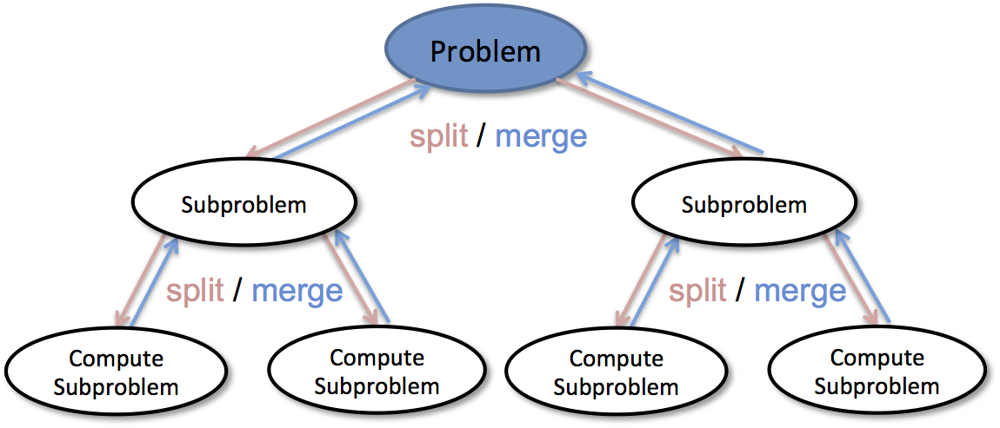

# TC2038 - Análisis y diseño de algoritmos avanzados
## Tema 1: Técnicas de diseño de algoritmos

**Profesor -  Alison Muñoz Capote**
Computación - Facultad de Ingeniería

---

## Mapa del Tema y Objetivos

### Objetivos Principales
1. Comprender los fundamentos y la lógica del paradigma **Divide y Vencerás**.
2. Identificar y aplicar los 3 momentos metodológicos: *Divide*, *Vence* y *Combina*.
3. Analizar la complejidad temporal de algoritmos recursivos usando el **Teorema Maestro**.

### Indice
* **1.1 Divide y vencerás**
  * Definición y lógica del paradigma
  * Los 3 momentos metodológicos
  * Esqueleto formal en Pseudocódigo
  * Teorema Maestro y análisis de complejidad

---

## 1.1 Situación Problemática: Búsqueda de Datos a Gran Escala

### El Reto de Localización de Registros en Tiempo Real
Imagina que trabajas como ingeniero de software en una plataforma global de comercio electrónico que almacena un historial con más de **1,000 millones de transacciones ordenadas** por ID único. Un usuario consulta en el sistema el estado de una compra específica mediante su número de rastreo.

Si empleamos una búsqueda secuencial o lineal ($O(n)$), el sistema tendría que revisar elemento por elemento, requiriendo hasta $10^9$ comparaciones en el peor caso. Esto provocaría latencias inaceptables de varios minutos por consulta y saturaría los servidores. 

¿Cómo podemos rediseñar el algoritmo para localizar una transacción específica en **milisegundos** aprovechando la estructura de los datos?

---

## 1.1 Teoría: Definición del Paradigma Divide y Vencerás

### Concepto Clave
Estrategia de diseño basada en la **recursión**. En lugar de resolver un problema complejo de forma directa o monolítica, este se desglose en subproblemas de menor tamaño pero con la misma estructura.

* **Fundamento:** Si una instancia es grande, se divide hasta alcanzar un tamaño trivial (*caso base*) que se pueda resolver directamente en $\Theta(1)$.
* **Impacto Computacional:** Permite reducir la complejidad cuadrática $O(n^2)$ a niveles cuasilineales u $O(n \log n)$.

---

## 1.1 Teoría: Los 3 Momentos del Paradigma

### 1. Divide
Fragmenta el problema original de tamaño $n$ en $a$ subproblemas más pequeños, cada uno de tamaño aproximado $n/b$.

### 2. Vence (Conquista)
Resuelve los subproblemas de forma recursiva. Si el subproblema es suficientemente pequeño, se resuelve de manera inmediata (caso base).

### 3. Combina
Mezcla e integra las soluciones independientes obtenidas para construir la solución completa del problema original.

---

## 1.1 Teoría: Esqueleto General

<pre><code class="language-pseudocode">
Función DivideYVenceras(Problema P)
    // 0. Caso Base (Condición de Paro)
    SI P es lo suficientemente pequeño (n <= constante_c) ENTONCES
        Retornar SolucionDirecta(P)
    FIN SI
    
    // 1. DIVIDE: Genera subproblemas
    Dividir P en subproblemas P1, P2, ..., Pk
    
    // 2. VENCE: Llamadas recursivas
    PARA CADA subproblema Pi HACER
        Solucion_i = DivideYVenceras(Pi)
    FIN PARA
    
    // 3. COMBINA: Sintetiza los resultados
    Retornar Combinar(Solucion_1, Solucion_2, ..., Solucion_k)
Fin Función
</code></pre>

---

## 1.1 Teoría: El Teorema Maestro

### La Ecuación de Recurrencia General
El **Teorema Maestro** (basado en Cormen) proporciona un método para resolver ecuaciones de recurrencia que surgen de algoritmos *Divide y Vencerás*. La forma estándar es:

$$T(n) = aT\left(\frac{n}{b}\right) + f(n)$$

* $n$: Tamaño del problema original.
* $a$: Número de subproblemas en la recursión ($a \ge 1$).
* $b$: Factor por el que se divide el tamaño del problema ($b > 1$).
* $f(n)$: Costo de las fases **Divide** y **Combina** juntas.

---

## 1.1 Teoría: Los 3 Casos del Teorema Maestro

Para determinar el orden de complejidad, comparamos la función $f(n)$ con la función $n^{\log_b a}$ (el peso de las hojas del árbol recursivo). 

1. **El peso está en las hojas (Caso 1):** Si $f(n) = O(n^{\log_b a - \epsilon})$ para algún $\epsilon > 0$, entonces la complejidad es dominada por la recursión:
   $T(n) = \Theta(n^{\log_b a})$
2. **El peso está equilibrado (Caso 2):** Si $f(n) = \Theta(n^{\log_b a})$, entonces el costo se distribuye uniformemente en todos los niveles:
   $T(n) = \Theta(n^{\log_b a} \log n)$
3. **El peso está en la raíz (Caso 3):** Si $f(n) = \Omega(n^{\log_b a + \epsilon})$, la fase de combinación domina:
   $T(n) = \Theta(f(n))$

---

## 1.1 Teoría: Ejemplo Aplicado a Búsqueda Binaria

### Análisis de Complejidad paso a paso
Analicemos la **Búsqueda Binaria** mediante el Teorema Maestro:

* **Divide:** Se evalúa el elemento medio y se descarta una mitad. Se resuelve **solo 1** subproblema: $a = 1$.
* **Tamaño:** La búsqueda se reduce exactamente a la mitad del arreglo: $b = 2$.
* **Combina:** Comparar el elemento objetivo requiere tiempo constante: $f(n) = \Theta(1)$.

**Ecuación de Recurrencia:** $T(n) = 1T(n/2) + \Theta(1)$
**Prueba:** $n^{\log_2 1} = n^0 = 1$. Como $f(n) = \Theta(1) = \Theta(n^{\log_2 1})$, aplicamos el **Caso 2**.
**Resultado Final:** $T(n) = \Theta(\log n)$

---

## 1.1 Solución: Búsqueda de Registros a Gran Escala

### Búsqueda de Transacciones en Tiempo Real
Volviendo a nuestro reto en el sistema de comercio electrónico:

* **Búsqueda Lineal ($O(n)$):** Para encontrar un registro específico entre **1,000,000,000** (mil millones) de transacciones, se requerirían hasta $10^9$ comparaciones en el peor caso (~varios minutos por consulta).
* **Búsqueda Binaria ($O(\log n)$):** Al organizar la base de datos con índices ordenados y aplicar *Divide y Vencerás*, reducir la búsqueda a un solo registro requiere como máximo:
  $$\log_2(1,000,000,000) \approx 30 \text{ comparaciones}$$

**Impacto:** Las consultas de usuarios pasan de tardar minutos a responder de manera instantánea en pocos **nanosegundos**.

---

## 1.1 Tarea Práctica: Ordenamiento de Datos Masivos

### Planteamiento de la Tarea
Trabajas como ingeniero de datos en una plataforma de comercio electrónico. Cada medianoche se genera un archivo log con **decenas de millones de registros de ventas desordenados**. Debes ordenarlos para construir el reporte analítico del día.

Usar *Bubble Sort* u otro algoritmo $O(n^2)$ tomaría horas y paralizaría los servidores. Tu objetivo es diseñar e implementar una solución basada en **Divide y Vencerás** que reduzca la complejidad a $O(n \log n)$.

### Instrucciones del Trabajo
1. **Modelado Algorítmico:** Explica formalmente los 3 momentos (*Divide*, *Vence* y *Combina*) aplicados al proceso de ordenamiento.
2. **Demostración Matemática:** Deduce la ecuación de recurrencia $T(n) = 2T(n/2) + \Theta(n)$ y demuestra con el **Teorema Maestro** que pertenece a $\Theta(n \log n)$.

---

## 1.1 Guía de Entregables de la Tarea

### Requerimientos de Código y Evaluación
* **Implementación Recursiva:** Escribir la función principal de ordenamiento y la función auxiliar de combinación (*Merge*) en C++ o Java.
* **Driver Program (`main`):** Incluir un programa de prueba ejecutable que demuestre el ordenamiento correcto de un arreglo de prueba.
* **Análisis Comparativo:** Agregar una breve conclusión cuantitativa calculando el número de operaciones en el peor caso para $n = 10,000,000$ de elementos ($O(n^2)$ vs. $O(n \log n)$).

**Formato:** Reporte PDF con el análisis + Código C++ o Java ejecutable (`.java`, `.cpp`).  
**Entrega:** Próxima sesión. Discusión con elección y discusión aleatoria de las mejores soluciones.

---

## 1.1 Problema: El Problema del Subarreglo Máximo

### El Reto Financiero: Optimización de Inversiones
Imagina que dispones del registro diario de ganancias y pérdidas del precio de las acciones de una empresa durante un periodo determinado:

$$A = [13, -3, -25, \mathbf{20, -3, -16, -23, 18, 20, -7, 12}, -5, -22, 15, -4, 7]$$

**Objetivo:** Determinar la secuencia contigua de días (subarreglo) en la que un inversionista debió comprar y vender para obtener la **máxima ganancia neta posible**.

### Desafío Algorítmico
* **Fuerza Bruta ($O(n^2)$):** Evaluar la suma de todos los pares de índices posibles requeriría un número cuadrático de comparaciones, siendo inviable para datos masivos.
* **Pregunta de Análisis:** ¿Cómo podemos dividir el arreglo para encontrar el subarreglo máximo en $O(n \log n)$ usando *Divide y Vencerás*?

---

## 1.1 Ejemplo 1: Estrategia por Divide y Vencerás

### Descomposición del Problema
Dado un arreglo $A[\text{low}..\text{high}]$ con punto medio $\text{mid} = \lfloor(\text{low} + \text{high})/2\rfloor$, la secuencia contigua de suma máxima debe encontrarse **estrictamente** en una de tres ubicaciones:

1. **Mitad Izquierda:** El subarreglo máximo está totalmente contenido en $A[\text{low}..\text{mid}]$.
2. **Mitad Derecha:** El subarreglo máximo está totalmente contenido en $A[\text{mid}+1..\text{high}]$.
3. **Cruzando el Centro:** El subarreglo inicia en la mitad izquierda ($i \le \text{mid}$) y termina en la mitad derecha ($j > \text{mid}$).

---

## 1.1 Ejemplo 1: Análisis del Caso Cruzado (Fase Combina)

### Algoritmo Lineal de Combinación
Para hallar el subarreglo que cruza el centro no podemos usar recursión simple. Se realiza un escaneo lineal desde $\text{mid}$:

* **Lado Izquierdo:** Acumula sumas desde $\text{mid}$ hacia $\text{low}$, conservando el máximo local ($O(n/2)$).
* **Lado Derecho:** Acumula sumas desde $\text{mid}+1$ hacia $\text{high}$, conservando el máximo local ($O(n/2)$).
* **Suma Total Cruzada:** $\text{SumaMáximaIzquierda} + \text{SumaMáximaDerecha}$.

**Costo de Combinar:** El recorrido requiere revisar linealmente todos los elementos de la partición: $f(n) = \Theta(n)$.

---

## 1.1 Ejemplo 1: Ecuación y Teorema Maestro

### Formulación Matemática
* **Divide:** Calcular el punto medio $\text{mid}$ toma tiempo constante $\Theta(1)$.
* **Vence:** Resolver $a = 2$ subproblemas (izquierda y derecha), cada uno de tamaño $n/b = n/2$.
* **Combina:** Encontrar el subarreglo cruzado requiere tiempo $f(n) = \Theta(n)$.

**Ecuación de Recurrencia:** $T(n) = 2T(n/2) + \Theta(n)$  
**Análisis con Teorema Maestro:**
* Parámetros: $a = 2, b = 2 \implies n^{\log_2 2} = n^1 = n$.
* Como $f(n) = \Theta(n) = \Theta(n^{\log_b a})$, aplica el **Caso 2**.

$$\mathbf{T(n) = \Theta(n \log n)}$$

---

## 1.1 Implementación en Java: Caso Cruzado (Combina)

<pre><code class="language-java">
// Objeto auxiliar para retornar resultado triple (inicio, fin, suma)
class SubarrayResult {
    int left, right, sum;
    SubarrayResult(int left, int right, int sum) {
        this.left = left; this.right = right; this.sum = sum;
    }
}

public class MaxSubarray {
    public static SubarrayResult findMaxCrossingSubarray(int[] A, int low, int mid, int high) {
        int leftSum = Integer.MIN_VALUE, sum = 0, maxLeft = mid;
        for (int i = mid; i >= low; i--) {
            sum += A[i];
            if (sum > leftSum) { leftSum = sum; maxLeft = i; }
        }
        int rightSum = Integer.MIN_VALUE; sum = 0; int maxRight = mid + 1;
        for (int j = mid + 1; j <= high; j++) {
            sum += A[j];
            if (sum > rightSum) { rightSum = sum; maxRight = j; }
        }
        return new SubarrayResult(maxLeft, maxRight, leftSum + rightSum);
    }
}
</code></pre>

---

## 1.1 Implementación en Java: Algoritmo Recursivo

<pre><code class="language-java">
public static SubarrayResult findMaximumSubarray(int[] A, int low, int high) {
    // Caso Base: Un solo elemento
    if (high == low) {
        return new SubarrayResult(low, high, A[low]);
    }
    
    int mid = low + (high - low) / 2;
    
    // Llamadas recursivas (Divide y Vence)
    SubarrayResult leftRes = findMaximumSubarray(A, low, mid);
    SubarrayResult rightRes = findMaximumSubarray(A, mid + 1, high);
    SubarrayResult crossRes = findMaxCrossingSubarray(A, low, mid, high);
    
    // Fase Combina: Elegir el mayor de los 3 casos
    if (leftRes.sum >= rightRes.sum && leftRes.sum >= crossRes.sum) {
        return leftRes;
    } else if (rightRes.sum >= leftRes.sum && rightRes.sum >= crossRes.sum) {
        return rightRes;
    } else {
        return crossRes;
    }
}
</code></pre>

---

## 1.1 Solución: Evaluación de Ganancia de Acciones

### Resultado de la Situación Financiera
Al ejecutar `findMaximumSubarray` sobre la serie temporal de acciones:
$$A = [13, -3, -25, \mathbf{20, -3, -16, -23, 18, 20, -7, 12}, -5, -22, 15, -4, 7]$$

El algoritmo identifica la ventana contigua del **índice 7 al 10** ($\mathbf{[18, 20, -7, 12]}$) obteniendo la **máxima ganancia total de 43**.

### Impacto en la Eficiencia
* **Fuerza Bruta ($O(n^2)$):** Requiere $\approx \frac{n^2}{2}$ iteraciones.
* **Divide y Vencerás ($O(n \log n)$):** Reduce el procesamiento de días de simulación bursátil a **milisegundos en Java**.

---

## 1.1 Ejemplo 2: Máximo y Mínimo Simultáneos

### El Reto de Optimización de Comparaciones
Imagina que estás diseñando el motor de procesamiento para un sistema embebido de monitoreo industrial que recibe un flujo masivo de lecturas de sensores desordenadas:

$$A = [34, 12, 89, 5, 67, 23, 91, 45]$$

**Objetivo:** Determinar simultáneamente el valor mínimo absoluto y el valor máximo absoluto del conjunto de datos para activar alarmas de seguridad.

### Desafío Algorítmico
* **Enfoque Iterativo Tradicional:** Recorrer el arreglo manteniendo dos variables (`min` y `max`). Cada elemento se compara con ambas variables, requiriendo **$2n - 2$ comparaciones** en el peor caso.
* **Pregunta de Análisis:** ¿Es posible reducir el número total de comparaciones de la CPU a $\approx 1.5n$ mediante *Divide y Vencerás*?

---

## 1.1 Ejemplo 2: Estrategia por Divide y Vencerás

### Descomposición de la Búsqueda
Para minimizar las comparaciones, dividimos el arreglo recursivamente hasta alcanzar subgrupos donde determinar el mínimo y máximo requiera el menor número de operaciones posibles:

* **Divide:** Se parte el arreglo $A[\text{low}..\text{high}]$ en dos subarreglos de tamaño $n/2$.
* **Vence:** Se obtiene el par $(\text{min}_1, \text{max}_1)$ de la mitad izquierda y $(\text{min}_2, \text{max}_2)$ de la mitad derecha.
* **Combina:** Se determina el mínimo global con **1 comparación** ($\min(\text{min}_1, \text{min}_2)$) y el máximo global con **1 comparación** ($\max(\text{max}_1, \text{max}_2)$).

---

## 1.1 Ejemplo 2: Análisis del Número de Comparaciones

### Deducción de la Recurrencia
Denotemos $C(n)$ como el número total de comparaciones necesarias para un arreglo de tamaño $n$:

* **Caso Base 1 ($n = 1$):** $0$ comparaciones ($\text{min} = \text{max} = A[0]$).
* **Caso Base 2 ($n = 2$):** **$1$ sola comparación** (si $A[0] < A[1]$, entonces $\text{min}=A[0]$ y $\text{max}=A[1]$).
* **Paso Recursivo ($n > 2$):** 
  $$C(n) = 2C(n/2) + 2$$

**Solución de la Recurrencia (para $n = 2^k$):**
$$C(n) = \frac{3n}{2} - 2$$
¡Logramos reducir las comparaciones de $2n - 2$ a exactamente **$1.5n - 2$**!

---

## 1.1 Implementación en Java: Estructura y Casos Base

<pre><code class="language-java">
// Estructura contenedora para retornar min y max simultáneamente
class Pair {
    int min;
    int max;
    Pair(int min, int max) {
        this.min = min;
        this.max = max;
    }
}

public class MinMaxDivideConquer {
    public static Pair getMinMax(int[] arr, int low, int high) {
        // Caso Base 1: Un solo elemento (0 comparaciones)
        if (low == high) {
            return new Pair(arr[low], arr[low]);
        }
        
        // Caso Base 2: Dos elementos (1 sola comparación)
        if (high == low + 1) {
            if (arr[low] < arr[high]) {
                return new Pair(arr[low], arr[high]);
            } else {
                return new Pair(arr[high], arr[low]);
            }
        }
        
        // Continúa en la siguiente diapositiva...
</code></pre>

---

## 1.1 Implementación en Java: Algoritmo Recursivo Completo

<pre><code class="language-java">
        // 1. DIVIDE: Calculamos punto medio
        int mid = low + (high - low) / 2;
        
        // 2. VENCE: Llamadas recursivas para ambas mitades
        Pair leftPair = getMinMax(arr, low, mid);
        Pair rightPair = getMinMax(arr, mid + 1, high);
        
        // 3. COMBINA: Solo 2 comparaciones para unir resultados
        int globalMin = (leftPair.min < rightPair.min) ? leftPair.min : rightPair.min;
        int globalMax = (leftPair.max > rightPair.max) ? leftPair.max : rightPair.max;
        
        return new Pair(globalMin, globalMax);
    }

    public static void main(String[] args) {
        int[] datos = {34, 12, 89, 5, 67, 23, 91, 45};
        Pair resultado = getMinMax(datos, 0, datos.length - 1);
        System.out.println("Mínimo: " + resultado.min + " | Máximo: " + resultado.max);
    }
}
</code></pre>

---

## 1.1 Solución e Impacto: Reducción del Trabajo Cómputo

### Optimización en Procesamiento Masivo
Para un conjunto de **1,000,000 de lecturas**:

* **Algoritmo Lineal Iterativo ($2n - 2$):** Ejecuta $\approx 1,999,998$ comparaciones de elementos en la CPU.
* **Divide y Vencerás ($\frac{3n}{2} - 2$):** Ejecuta exactamente **$1,499,998$ comparaciones**.

**Ahorro Operativo:** Se elimina un **25% de las instrucciones de comparación** a nivel de ensamblador/CPU, reduciendo el consumo energético y la latencia en hardware de recursos restringidos.

