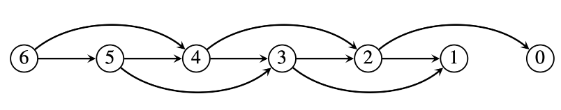
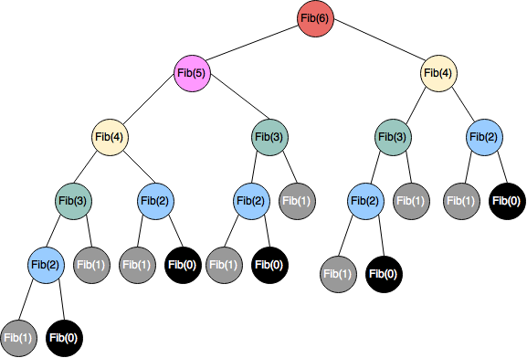
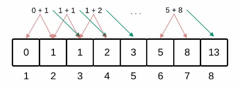

# TC2038 - Análisis y diseño de algoritmos avanzados
## Tema 1.2: Programación Dinámica

**Profesor - Alison Muñoz Capote**
Tecnológico de Monterrey

---

## Mapa del Tema y Objetivos

<div class="info-box">

### Objetivos Principales
1. Comprender los fundamentos y la lógica detrás del paradigma de la **Programación Dinámica**.
2. Identificar problemas que presentan la propiedad de *solapamiento de subproblemas*.
3. Transformar algoritmos recursivos ineficientes en soluciones de tiempo polinómico utilizando grafos de dependencias y memo-ización.
</div>

<div class="concept-box">

### Subtemas a cubrir (2.5 hrs estimadas)
* **1.2 Programación dinámica**
  * Introducción al paradigma y Grafos de Subproblemas.
  * Análisis de Subproblemas Solapados (Ej. Fibonacci).
  * Enfoque Top-Down (Memo-ización) vs Bottom-Up (Tabulación).
  * Casos clásicos: Multiplicación de Sucesión de Matrices y Árboles Óptimos.
</div>

---

## 1.2 Situación Problemática: El Colapso Recursivo

<div class="problem-box">

### El Reto de los Cálculos Repetitivos
Imagina que estás desarrollando un simulador financiero que requiere calcular términos avanzados de la secuencia de Fibonacci. Decides utilizar un diseño descendente (*Top-Down*) mediante una función puramente recursiva. 

Si pruebas calcular `fib(6)`, el sistema responde rápido. Sin embargo, al intentar calcular `fib(50)`, la computadora parece congelarse y los servidores agotan sus recursos. ¿Por qué una definición matemática tan simple provoca una ineficiencia tan masiva y cómo podemos rediseñar el cálculo para obtener resultados instantáneos?
</div>

<div class="info-box">

*Nota para la clase:* El diseño descendente es natural, pero si no se controla adecuadamente, un algoritmo recursivo puede perder muchísima eficiencia.
</div>

---

## 1.2 ¿Qué es la Programación Dinámica?

<div class="info-box">

### Origen y Definición
El término fue acuñado en 1957 por **Richard Bellman** para describir un método de solución de problemas de control óptimo. La palabra **_dinámica_** da la idea de que las opciones dependen del estado actual.
</div>

<div class="concept-box">

* **La Esencia del Paradigma:** Un algoritmo de programación dinámica almacena los resultados de subproblemas más pequeños y los consulta en lugar de volver a calcularlos cuando los necesita para resolver subproblemas más grandes.
* **Ventaja Computacional:** Su característica principal es que sustituye un cálculo en tiempo exponencial por un cálculo en tiempo polinómico.
* **Aplicabilidad:** Es idónea para problemas donde un algoritmo recursivo resolvería muchos de los subproblemas repetidas veces.
</div>

---

## 1.2 Teoría: Grafos de Subproblema y Dependencias

<div class="info-box">

### Modelando las Relaciones
Cuando descomponemos un problema grande, podemos definir un **grafo dirigido** basado en las relaciones de dependencia entre los problemas y sus subproblemas pertinentes.
</div>

<div class="concept-box">

* **Nodos y Aristas:** Cada vértice es un subproblema. Una arista dirigida indica que la solución de un problema depende de la solución de otro.
* **Orden Topológico Inverso:** La esencia de la programación dinámica consiste en hallar un orden topológico inverso para este grafo y asentar (almacenar) las soluciones para que las usen otros subproblemas posteriormente.
* En problemas simples como Fibonacci, el orden es simplemente ascendente.
</div>



---

## 1.2 Implementación: El Enfoque Recursivo Natural

<div class="concept-box">

### Código Recursivo Tradicional
```python
def fib_recursivo(n):
    # Caso base
    if n <= 1:
        return n
    
    # Llamada recursiva
    return fib_recursivo(n-1) + fib_recursivo(n-2)
```
</div>

<div class="problem-box">

### Deficiencias Críticas del Enfoque
* **Trabajo Repetitivo masivo:** El cálculo recursivo natural es terriblemente ineficiente porque se repite gran parte del trabajo.
* **Complejidad Exponencial:** El árbol de activación es un árbol binario completo hasta la profundidad $n/2$, por lo que el tiempo de ejecución está por lo menos en $\Omega(2^{n/2})$.
* **Desbordamiento de Pila (Stack Overflow):** Para valores grandes de $n$, la recursión profunda satura la memoria del sistema.
</div>

---

## 1.2 Transformación de Recursión a DP

<div class="concept-box">

### Memo-ización (Top-Down)
La versión de programación dinámica de un algoritmo recursivo efectúa una búsqueda *primero en profundidad* (DFS) en el grafo de subproblemas. Conforme se obtienen soluciones, estas se guardan en una estructura de datos o diccionario.
</div>

<div class="concept-box">

* **El Diccionario (Tabla/Memoria):** A este proceso de asentar soluciones se le conoce como **memo-ización**.
* **Operaciones Clave:** Antes de ejecutar una llamada recursiva, el sistema verifica el diccionario. Si la respuesta existe (`recuperar`), se usa instantáneamente; si no (`almacenar`), se calcula y se guarda.
* **Identificadores Concisos:** Para que el algoritmo sea eficiente y mantenga un tiempo polinómico, es crítico que cada subproblema tenga un identificador conciso (ej. un índice entero).
</div>
 
---

## 1.2 Implementación: DP con Memo-ización (Top-Down)

<div class="concept-box">

### Código Optimizado en C++


```cpp
#include <iostream>;
#include <vector>;

// Función Recursiva Principal
long long fibPD(int k, std::vector&lt;long long&gt;& soln) {
    // 1. RECUPERAR: Verificar si ya existe en el diccionario
    if (soln[k] != -1) return soln[k];

    // Caso base
    if (k <= 1) return k;

    // 2. ALMACENAR: Calcular y asentar el resultado
    soln[k] = fibPD(k - 1, soln) + fibPD(k - 2, soln);
    return soln[k];
}

// Envoltura (Wrapper)
long long envoltFibPD(int n) {
    // Creamos el diccionario (arreglo) inicializado en -1
    std::vector&lt;long long&gt; soln(n + 1, -1);
    return fibPD(n, soln);
}
```
</div>

---

## 1.2 Análisis de la Memo-ización (Top-Down)

<div class="info-box">

### Comentarios para esclarecer el concepto
* **El Diccionario (`soln`):** Es la estructura clave. Se inicializa con un valor especial (ej. `-1`). Si al consultar tiene un valor diferente, se devuelve instantáneamente.
* **El Flujo de Ejecución (DFS):** Efectúa una búsqueda *primero en profundidad*. Solo viaja hasta el fondo de la recursión la primera vez; las ramas repetidas se detienen en $\Theta(1)$ al recuperar el dato.
</div>

<div class="solution-box">

### Análisis de Complejidad (Top-Down)
* **Complejidad de Tiempo:** $\Theta(n)$. Existen $n$ subproblemas distintos (calcular desde $1$ hasta $n$). Cada subproblema se calcula exactamente *una sola vez* mediante una suma constante $\Theta(1)$. Las llamadas repetidas simplemente consultan el diccionario en $\Theta(1)$.
* **Complejidad de Espacio:** $\Theta(n)$. El algoritmo requiere $\Theta(n)$ de memoria para almacenar el arreglo `soln`. Adicionalmente, requiere $\Theta(n)$ de espacio en la memoria del sistema para mantener la **pila de llamadas recursivas** (*Call Stack*) antes de llegar al caso base.
</div>

---

## 1.2 Implementación: Fibonacci con Tabulación

<div class="concept-box">

```java
public class FibonacciDP {
    public static long fibTabulacion(int n) {
        // Caso base inmediato
        if (n <= 1) return n;

        // 1. Crear la tabla (arreglo) de tamaño n + 1
        long[] table = new long[n + 1];

        // 2. Inicializar los casos base (Bottom)
        table[0] = 0;
        table[1] = 1;

        // 3. Llenar la tabla iterativamente (Up)
        for (int i = 2; i <= n; i++) {
            table[i] = table[i - 1] + table[i - 2];
        }

        // Resultado en la posición objetivo
        return table[n];
    }
}
```

</div>

---

## 1.2 Análisis de la Tabulación (Bottom-Up)

<div class="info-box">

* **Eliminación de la Recursión:** A diferencia de la memo-ización, este enfoque utiliza un ciclo iterativo. Esto elimina por completo el riesgo de desbordamiento de pila (*Stack Overflow*).
* **Llenado Sistemático:** Resolvemos los subproblemas menores primero (índices 0 y 1) y avanzamos sistemáticamente hacia el problema mayor $n$.

</div>

<div class="solution-box">

* **Complejidad de Tiempo:** $\Theta(n)$. Un solo ciclo `for` efectúa el cálculo iterativo paso a paso.
* **Complejidad de Memoria:** $\Theta(n)$. Se requiere el arreglo `table`. (Nota: es posible optimizar la memoria a $\Theta(1)$ si solo conservamos los dos últimos cálculos).

</div>

<!-- Imagen sugerida: Diagrama de un arreglo lineal enumerado del 0 al n, con flechas curvas mostrando cómo los valores de las posiciones (i-1) e (i-2) se suman para depositarse en la posición i, llenándose de izquierda a derecha. -->


---

## 1.2 Comparativa Top-Down vs. Bottom-Up (Parte 1)

<div class="concept-box">

### 1. Top-Down con Memo-ización (Memoization)
* **Mecánica:** Se mantiene la estructura recursiva natural del problema.
* **Ejecución:** Antes de computar $f(state)$, se consulta una tabla o hash. Si ya fue calculado, se retorna inmediatamente.
* **Ventaja Principal:** Solo calcula los estados estrictamente necesarios.

</div>

<div class="concept-box">

### 2. Bottom-Up con Tabulación (Tabulation)
* **Mecánica:** Se resuelven primero los casos base y se llena una tabla de forma iterativa de lo más pequeño a lo más grande.
* **Ejecución:** Evita la recursión procesando el grafo de dependencias de abajo hacia arriba de manera sistemática.
* **Ventaja Principal:** Elimina la sobrecarga de llamadas recursivas en el stack y facilita la optimización de espacio.

</div>

---

<style scoped>
section {
  justify-content: flex-start;
}
.grid-container {
  display: grid;
  grid-template-columns: 1fr 1fr;
  gap: 20px;
  width: 100%;
  margin-bottom: 10px;
}
.grid-col {
  text-align: center;
}
.grid-col img {
  width: 100%;
  max-height: 180px;
  object-fit: contain;
}
</style>

## 1.2 Teoría: Comparativa Top-Down vs. Bottom-Up (Parte 2)

<div class="grid-container">
  <div class="grid-col">
    <h4 style="margin: 0 0 5px 0; color: #003366;">Top-Down (Memo-ización)</h4>
    
  </div>
  <div class="grid-col">
    <h4 style="margin: 0 0 5px 0; color: #003366;">Bottom-Up (Tabulación)</h4>
    
  </div>
</div>

<div class="solution-box">

### Conclusión para Fibonacci

Ambas técnicas transforman la complejidad original exponencial en un tiempo polinómico $\Theta(n)$, logrando resultados casi instantáneos. La elección dependerá de si necesitamos evaluar absolutamente todos los subproblemas (ideal para Bottom-Up) o solo una rama específica de ellos (ideal para Top-Down).

</div>

---

## 1.2 Situación Problemática: Climbing Stairs

<div class="problem-box">

### Reto 1
Estás subiendo una escalera de **$n$ escalones**. En cada movimiento puedes subir **1 o 2 escalones**. 

**¿De cuántas formas distintas puedes llegar a la cima?**

**Casos de prueba:**

* **Ejemplo 1 ($n = 2$): 2 formas**
  * Opción 1: $1 + 1$
  * Opción 2: $2$

* **Ejemplo 2 ($n = 3$): 3 formas**
  * Opción 1: $1 + 1 + 1$
  * Opción 2: $1 + 2$
  * Opción 3: $2 + 1$
</div>

---

## 1.2 Situación Problemática: Min Cost Climbing Stairs

<div class="problem-box">

### Reto 2
Dado un arreglo **$\text{cost}$** donde $\text{cost}[i]$ es el costo asignado al $i$-ésimo escalón. Una vez pagado el costo de un escalón, puedes subir **1 o 2 escalones**.

Puedes iniciar la subida libremente desde el **índice 0** o el **índice 1**.

**Objetivo:** Encontrar el costo mínimo para alcanzar la cima (índice $n$, fuera del arreglo).

**Ejemplo:**
* **Entrada:** $\text{cost} = [10, 15, 20]$
* **Salida:** **15**
* **Trayecto:** Inicias en el índice 1, pagas 15 y saltas 2 escalones directo a la cima.
</div>

---

## Observaciones

<div class="info-box">

* **De conteo a optimización:**
  A diferencia de *Climbing Stairs* tradicional donde se suman las opciones ($+$), aquí se busca el camino de menor impacto seleccionando el mínimo ($\min$).

* **Definición del estado $dp[i]$ (Punto crítico de confusión):**
  $dp[i]$ representa el costo acumulado para **llegar** al escalón $i$.

* **Ecuación de Recurrencia:**
  Si $dp[i]$ es el costo mínimo para llegar al escalón $i$:
  $$dp[i] = \min(dp[i-1] + \text{cost}[i-1],\, dp[i-2] + \text{cost}[i-2])$$

* **Casos base y destino:**
  * **Casos base:** $dp[0] = 0$ y $dp[1] = 0$ (entrar a los escalones 0 o 1 no cuesta nada).
  * **Meta:** La cima está en $dp[n]$ (un paso más allá de $\text{cost}[n-1]$).
</div>

---

## 1.2 Situación Problemática: Longest Increasing Subsequence (LIS)

<div class="problem-box">

### Reto 3

Dado un arreglo de enteros **$\text{nums}$**, devuelve la longitud de la **subsecuencia estrictamente creciente** más larga.

**Nota:** Una *subsecuencia* mantiene el orden relativo original pero **no necesita ser contigua**.

**Ejemplo:**
* **Entrada:** $\text{nums} = [10, 9, 2, 5, 3, 7, 101, 18]$
* **Salida:** **4**
* **Subsecuencia válida:** $[2, 3, 7, 101]$ (también $[2, 5, 7, 101]$)

</div>

---

## Observaciones

<div class="info-box">

* **Subsecuencia vs. Subarreglo (Distinción clave):**
  Un *subarreglo* exige elementos contiguos. Una *subsecuencia* permite omitir elementos intermedios siempre que conserve el orden.

* **Definición del estado $dp[i]$:**
  $dp[i]$ representa la longitud de la LIS que **termina obligatoriamente en el índice $i$**. Es un error común intentar guardar la LIS global hasta $i$.

* **Ecuación de Recurrencia:**
  Revisamos todos los elementos previos $j < i$ que sean menores a $\text{nums}[i]$:
  $$dp[i] = 1 + \max(\{dp[j] \mid j < i \text{ y } \text{nums}[j] < \text{nums}[i]\} \cup \{0\})$$

* **Evolución de Complejidad:**
  1. **Programación Dinámica estándar:** $O(n^2)$ tiempo / $O(n)$ memoria.
  2. **Optimización con Búsqueda Binaria (Patience Sorting):** $O(n \log n)$ tiempo. Es una excelente oportunidad para usar `bisect`.

</div>