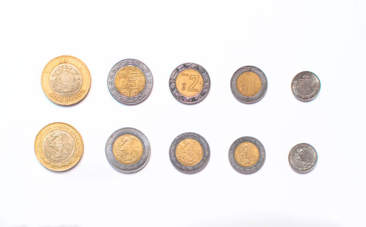

# TC3009C - I.A. avanzada para ciencia de datos
## Tema 1.3 Algoritmos Avaros

Profesor - Alison Muñoz Capote  
Computación - Facultad de Ingeniería

---

# Mapa del Tema y Objetivos

<div class="info-box">

### Objetivos del Tema:
* **Comprender el paradigma de diseño de los algoritmos avaros y sus características fundamentales.**
* **Analizar problemas de optimización para determinar si un enfoque avaro es aplicable.**
* **Diseñar e implementar soluciones avaras.**
* **Identificar las limitaciones estructurales del enfoque avaro y conocer las alternativas algorítmicas.**

</div>

<div class="concept-box">

### Índice:
1. **Conceptos Fundamentales: ¿Qué hace "avaro" a un algoritmo?**
2. Análisis y Diseño: Solución al Cambio de Monedas
3. Límites del Enfoque: Cuando la avaricia falla
4. Caso de Estudio: Redes Óptimas (Algoritmo de Kruskal)
5. Análisis y Diseño: Solución de Kruskal paso a paso
6. Conclusiones y Estudio Independiente

</div>

---

# El Problema del Cajero

<div class="problem-box">

**Caso de Estudio 1**

Imagina que trabajas en un punto de venta. Un cliente te paga y debes devolver exactamente $18 pesos de cambio utilizando el sistema monetario estándar (monedas de $10, $5, $2 y $1).

El objetivo de optimización: Dar el cambio utilizando la menor cantidad de monedas posible para no vaciar la caja registradora.

¿Cómo lo resuelve nuestra mente de forma natural e intuitiva sin conocer teoría de algoritmos?

</div>



---

# Conceptos Fundamentales
_El paradigma Avaro (Greedy) construye una solución paso a paso siguiendo tres principios:_

<div class="info-box">

* **Miopía (Óptimo Local):** En cada paso, toma la decisión que parece ser la mejor en ese momento exacto, sin calcular el impacto a futuro.

* **Irrevocabilidad (Sin arrepentimiento):** Una vez que toma una decisión, jamás da marcha atrás ni la reconsidera. No hay backtracking.

* **Eficiencia:** Suele ser muy rápido porque no explora todas las combinaciones posibles, pero no siempre garantiza la solución óptima global.

</div>

---

# Análisis y Diseño: Cambio de Monedas

_**Análisis del problema:**_

<div class="solution-box">

Para dar la menor cantidad de monedas, debemos priorizar siempre las monedas de mayor denominación hasta que ya no quepan en el monto restante.
</div>

Pseudocódigo:
```
FUNCIÓN DarCambio(monto, denominaciones):
    Ordenar denominaciones de mayor a menor
    resultado = lista vacía
    
    PARA CADA moneda EN denominaciones:
        MIENTRAS monto >= moneda:
            Añadir moneda a resultado
            monto = monto - moneda
            
    RETORNAR resultado
```