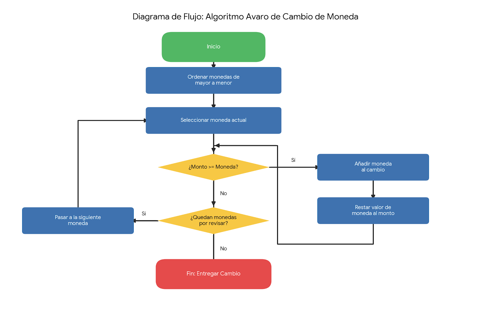
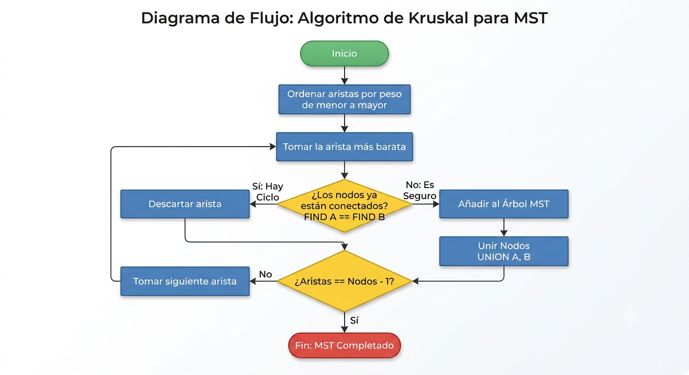

# TC2038 - Análisis y diseño de algoritmos avanzados
## Tema 1.3 Algoritmos Avaros

Profesor - Alison Muñoz Capote  
Computación - Facultad de Ingeniería

---

# Mapa del Tema y Objetivos

<div class="info-box">

### Objetivos del Tema:
* **Comprender el paradigma de diseño de los algoritmos avaros y sus características fundamentales.**
* **Analizar problemas de optimización para determinar si un enfoque avaro es aplicable.**
* **Diseñar e implementar soluciones avaras.**
* **Identificar las limitaciones estructurales del enfoque avaro y conocer las alternativas algorítmicas.**

</div>

<div class="concept-box">

### Índice:
1. **Conceptos Fundamentales: ¿Qué hace "avaro" a un algoritmo?**
2. **Análisis y Diseño: Solución al Cambio de Monedas**
3. **Límites del Enfoque: Cuando la avaricia falla**
4. **Caso de Estudio: Redes Óptimas (Algoritmo de Kruskal)**
5. **Análisis y Diseño: Solución de Kruskal paso a paso**
6. **Conclusiones y Estudio Independiente**

</div>

---

# El Problema del Cajero

<div class="problem-box">

**Caso de Estudio 1**

Imagina que trabajas en un punto de venta. Un cliente te paga y debes devolver exactamente $18 pesos de cambio utilizando el sistema monetario estándar (monedas de $10, $5, $2 y $1).

**El objetivo de optimización:** Dar el cambio utilizando la menor cantidad de monedas posible para no vaciar la caja registradora.

¿Cómo lo resuelve nuestra mente de forma natural e intuitiva sin conocer teoría de algoritmos?

</div>


---

# Conceptos Fundamentales
_El paradigma Avaro (Greedy) construye una solución paso a paso siguiendo tres principios:_

<div class="info-box">

* **Óptimo Local:** En cada paso, toma la decisión que parece ser la mejor en ese momento exacto, sin calcular el impacto a futuro.

* **Irrevocabilidad (Sin arrepentimiento):** Una vez que toma una decisión, jamás da marcha atrás ni la reconsidera. No hay backtracking.

* **Eficiencia:** Suele ser muy rápido porque no explora todas las combinaciones posibles, pero no siempre garantiza la solución óptima global.

</div>

---

# Análisis y Diseño: Cambio de Monedas

_**Análisis del problema:**_

<div class="solution-box">

Para dar la menor cantidad de monedas, debemos priorizar siempre las monedas de mayor denominación hasta que ya no quepan en el monto restante.
</div>

**Pseudocódigo:**
```
FUNCIÓN DarCambio(monto, denominaciones):
    Ordenar denominaciones de mayor a menor
    resultado = lista vacía
    
    PARA CADA moneda EN denominaciones:
        MIENTRAS monto >= moneda:
            Añadir moneda a resultado
            monto = monto - moneda
            
    RETORNAR resultado
```

---

# Diagrama de Flujo




---

# Solución en Python
```python 
def algoritmo_avaro_monedas(monto, denominaciones):
    # Aseguramos que las monedas estén de mayor a menor
    denominaciones.sort(reverse=True)
    cambio = []
    
    for moneda in denominaciones:
        while monto >= moneda:
            cambio.append(moneda)
            monto -= moneda
            
    return cambio

# Prueba del algoritmo
sistema_normal = [1, 2, 5, 10]
monto_objetivo = 18

resultado = algoritmo_avaro_monedas(monto_objetivo, sistema_normal)
print(f"Cambio para ${monto_objetivo}: {resultado}")
print(f"Total de monedas: {len(resultado)}") 
# Salida: [10, 5, 2, 1] (4 monedas)
```

---

# Límites del Enfoque: Cuando la avaricia falla

<div class="problem-box">

¿Qué pasa si nuestro sistema monetario cambia y ahora tenemos monedas de $11, $5 y $1? Queremos dar cambio de $15.

</div>

---

# Límites del Enfoque: Cuando la avaricia falla

<div class="problem-box">

¿Qué pasa si nuestro sistema monetario cambia y ahora tenemos monedas de $11, $5 y $1? Queremos dar cambio de $15.

</div>

<div class="solution-box">

**_Ejecución Avara:_**

Toma $11 (Faltan $4).

Toma $1 x 4 veces (Falta $0).
_Resultado Avaro_: 5 monedas ($11, $1, $1, $1, $1).

**Solución Óptima Real:**
_Resultado Óptimo_: 3 monedas ($5, $5, $5).

</div>

**Conclusión:** El algoritmo avaro fracasó. Al tomar el **$11** bloqueó el camino hacia la verdadera solución óptima.
**_Solución futura:_** Para estos casos, utilizamos la _Programación Dinámica_, que evalúa subproblemas superpuestos para encontrar el óptimo global garantizado.

---

# Redes Óptimas (Algoritmo de Kruskal)

<div class="problem-box">

**Caso de Estudio 2**

Necesitamos conectar los servidores de 5 municipios (Toluca, Metepec, Zinacantepec, Lerma, San Mateo) con cable subterráneo de fibra óptica al menor costo posible (menor cantidad de kilómetros).

Tenemos un grafo donde los nodos son las ciudades y las aristas son los caminos posibles con sus distancias.

**El objetivo de optimización:** Conectar todos los nodos sin ciclos, utilizando las aristas más baratas. A esto se le llama _Árbol de Expansión Mínima_ **(MST)**.
</div>

---

# Análisis y Diseño: Kruskal

<div class="solution-box">

**Lógica Avara:** "Ordena todas las conexiones de la más barata a la más cara. Toma la más barata, a menos que forme un ciclo cerrado (bucle). Repite hasta conectar todo."

Para detectar ciclos eficientemente, usamos la estructura de datos  **Union-Find** (_Conjuntos Disjuntos_), que mantiene un registro de quién está conectado con quién mediante una jerarquía de _jefes_ o raíces.

</div>

```
FUNCIÓN Kruskal(Grafo):
    MST = lista vacía
    Ordenar todas las aristas del Grafo por peso (de menor a mayor)
    Inicializar Union-Find para cada vértice
    
    PARA CADA arista (u, v) EN aristas_ordenadas:
        SI FIND(u) != FIND(v):  // No forman ciclo
            Añadir arista a MST
            UNION(u, v)         // Fusionar conjuntos
            
        SI tamaño de MST == Nodos - 1:
            ROMPER ciclo
            
    RETORNAR MST
```

---

# Diagrama de Flujo



---

# Solución en Python

```python 
class UnionFind:
    def __init__(self, vertices):
        self.padre = {v: v for v in vertices}

    def find(self, item):
        if self.padre[item] == item:
            return item
        # Compresión de ruta para mayor eficiencia
        self.padre[item] = self.find(self.padre[item])
        return self.padre[item]

    def union(self, set1, set2):
        raiz1 = self.find(set1)
        raiz2 = self.find(set2)
        self.padre[raiz1] = raiz2

def kruskal(vertices, aristas):
    # arista = (peso, nodo_origen, nodo_destino)
    aristas.sort() # El paso avaro: ordenar de menor a mayor
    uf = UnionFind(vertices)
    mst = []
    
    for peso, u, v in aristas:
        if uf.find(u) != uf.find(v):
            uf.union(u, v)
            mst.append((u, v, peso))
            if len(mst) == len(vertices) - 1:
                break
    return mst

# Prueba: Red de Fibra Óptica
nodos = ['Toluca', 'Metepec', 'Zinacantepec', 'Lerma', 'San Mateo']
cables = [
    (5, 'Lerma', 'San Mateo'), (6, 'Metepec', 'San Mateo'),
    (7, 'Toluca', 'Metepec'), (8, 'Toluca', 'Zinacantepec'),
    (12, 'Zinacantepec', 'Metepec'), (15, 'Toluca', 'Lerma')
]

print("Conexiones seleccionadas (MST):", kruskal(nodos, cables))
```

---

# Conclusiones

_La Esencia de la Avaricia Algorítmica_
<div class="solution-box">

* **El presente lo es todo:** El algoritmo toma la mejor decisión local e inmediata en cada paso (el óptimo local), ignorando por completo las consecuencias futuras.

* **Cero arrepentimientos:** Una decisión tomada jamás se revierte ni se reevalúa. El enfoque avaro avanza en una sola dirección.

* **Velocidad como ventaja:** Al no explorar exhaustivamente todos los caminos posibles, son algoritmos extremadamente rápidos y eficientes en consumo de recursos.

* **Garantía condicional:** Encuentran el óptimo global solo si el problema tiene la estructura subyacente adecuada (como el algoritmo de Kruskal en grafos o el sistema de monedas estándar).

* **El límite de la técnica:** Si el problema exige reconsiderar decisiones pasadas o evaluar escenarios futuros, la estrategia avara fracasa y debemos recurrir a la Programación Dinámica o al Backtracking.

</div>

---

# Tarea

<div class="problem-box">

**El Problema de las 8 Reinas (Una tentación avara)**

**Planteamiento:** Colocar $8$ reinas en un tablero de ajedrez de $8x8$ de forma que ninguna se ataque entre sí (ni vertical, horizontal, ni diagonalmente).

**Tu misión para la próxima clase:**
Intenta resolver este problema a mano utilizando exclusivamente una estrategia avara pura (tomando la primera casilla segura sin mirar atrás).

* ¿Lograste acomodar las 8 reinas?

* ¿En qué punto te quedaste sin opciones ("callejón sin salida")?

</div>

**Conclusión preliminar:** El enfoque avaro fracasa aquí porque requiere reconsiderar decisiones pasadas. En la próxima clase descubriremos cómo resolverlo con **_Backtracking_**.