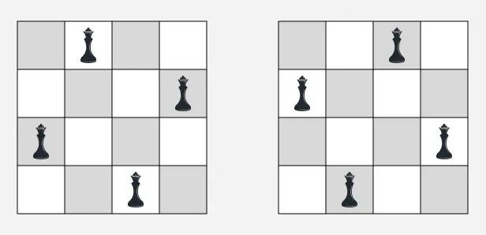
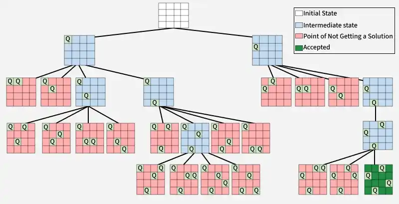
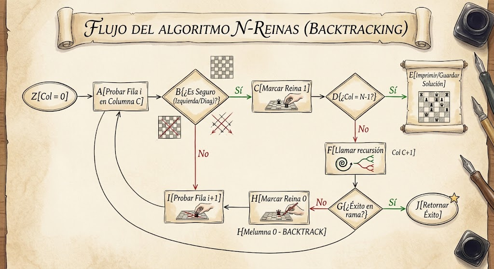
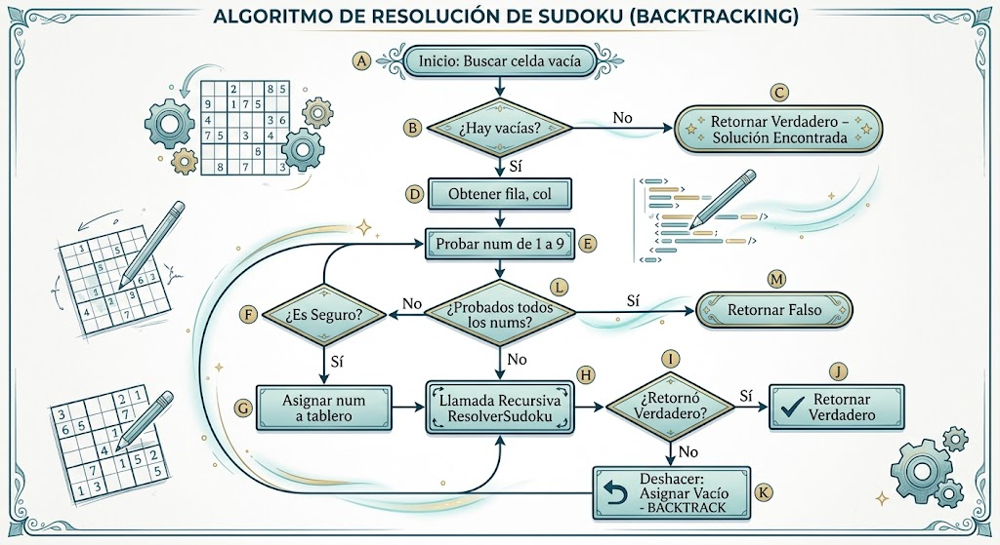

# TC2038 - Análisis y diseño de algoritmos avanzados
## Tema 1.4 Backtracking

**Profesor** - Alison Muñoz Capote  
**Computación - Facultad de Ingeniería**

---

# Mapa del Tema y Objetivos

<div class="info-box">

### Objetivos del Tema:
* **Comprender** los fundamentos y la lógica subyacente de la técnica algorítmica de Backtracking.
* **Analizar** el origen histórico y la evolución matemática de la técnica.
* **Modelar** problemas complejos utilizando árboles de espacio de estados.
* **Diseñar e implementar** soluciones eficientes en Python aplicando poda de búsqueda.
* **Evaluar** la complejidad temporal y espacial de los algoritmos diseñados.

</div>

<div class="concept-box">

### Índice:
1. Situación Problema: El Sudoku
2. Definiciones Fundamentales
3. Análisis y Diseño: Resolviendo El Sudoku
4. Otro ejemplo: Las N-Reinas
5. Estudio Independiente

</div>

---

# El Dilema de las Restricciones

<div class="info-box">

En la computación diaria, los problemas de optimización y satisfacción de restricciones son omnipresentes. Imaginemos que necesitamos asignar horarios a clases, enrutar paquetes en una red, o encontrar la contraseña correcta de un sistema. 

_¿Qué hacemos cuando el espacio de posibles combinaciones es tan masivo que la computación de fuerza bruta tomaría años?_

</div>

---

# Las N-Reinas

<div class="problem-box">

**Caso de Estudio 1**

Para ilustrar lo anterior, consideremos el clásico problema de las **N-Reinas**.

**Problema:** Colocar $N$ reinas de ajedrez en un tablero de $N \times N$ de manera que ninguna reina amenace a otra.
* *Restricción:* Ninguna reina puede compartir la misma fila, columna o diagonal.
  
</div>



---

# El Fracaso de la Fuerza Bruta

<div class="alert-box">

Si intentamos resolver el problema de las N-Reinas (asumiendo que simplificamos colocando una reina por columna) mediante fuerza bruta y a ciegas:

* Hay $N$ columnas en el tablero.
* Cada columna tiene $N$ opciones posibles (las filas).
* Combinaciones posibles: $N^N$. Para un tablero clásico de 8x8, son $8^8 \approx 1.67 \times 10^7$ posiciones. Sin embargo, para un tablero moderadamente más grande como $N=20$, el número se dispara a $20^{20} \approx 1.04 \times 10^{26}$.

_(Observación: Si hiciéramos fuerza bruta absoluta sin restringir a una reina por columna, buscando colocar $N$ piezas en $N^2$ casillas, las combinaciones serían $\binom{N^2}{N}$, lo cual es aún peor)_.

Este crecimiento exponencial hace que el enfoque ingenuo sea computacionalmente inabordable a medida que $N$ aumenta. Necesitamos un enfoque que construya la solución de forma inteligente y descarte caminos incorrectos rápidamente en cuanto detecte que dos reinas se amenazan.

</div>

---

# Los Orígenes Matemáticos

<div class="solution-box">

Aunque la idea de "ensayo y error sistemático" es antigua, el concepto formal se remonta a los años 50.
* **1950s:** El matemático **D. H. Lehmer** investigaba problemas combinatorios y algoritmos de búsqueda.
* Él sentó las bases para buscar soluciones parciales que pudieran ser abandonadas si no cumplían ciertas propiedades numéricas.

</div>

<div class="info-box">

**Acuñando el Término _Backtrack_**

El término **Backtrack** fue acuñado formalmente por **Derrick Henry Lehmer** (o frecuentemente atribuido al trabajo de **R. J. Walker** en 1960). Walker publicó un algoritmo general para encontrar soluciones a problemas combinatorios, formalizando la técnica de volver atrás sobre el rastro (_backtracking_).

</div>

---

# Consolidación en las Ciencias de la Computación

<div class="info-box">

* **1965:** Solomon W. Golomb y Leonard D. Baumert publicaron "**Backtrack Programming**" en la revista del ACM.
* Este fue el artículo seminal que estandarizó el uso del backtracking como una técnica formal de programación aplicable a compiladores, inteligencia artificial y resolución de teoremas.

</div>

---

# ¿Qué es el Backtracking?

<div class="solution-box">

**Backtracking** es una técnica algorítmica para encontrar soluciones (algunas o todas) a problemas de satisfacción de restricciones, construyendo de forma incremental soluciones candidatas. 

En el momento en que se determina que un candidato parcial no puede ser completado hasta una solución válida, el algoritmo lo abandona (_retrocede_) y prueba otra alternativa.

</div>

---

# El Espacio de Estados

<div class="info-box">

El **Espacio de Estados** es el conjunto de todas las configuraciones posibles (válidas o inválidas) que se pueden generar para un problema.

En _backtracking_, no generamos todo el espacio de estados a priori, sino que lo exploramos dinámicamente mediante decisiones secuenciales.

</div>



---

# El Árbol de Búsqueda

<div class="info-box">

El algoritmo modela el problema como un **Árbol de Espacio de Estados**.

* **Raíz:** El estado inicial (solución vacía).
* **Nodos:** Soluciones parciales construidas al tomar una decisión.
* **Hojas:** Soluciones completas (válidas) o estados sin salida.

</div>


---

# Nodos y Promesas

<div class="info-box">

* **Nodo Prometedor (Promising Node):** Un estado parcial que no viola ninguna restricción del problema y, por tanto, tiene el potencial de llevar a una solución completa.
* **Nodo No Prometedor (Non-promising Node):** Un estado parcial que viola alguna regla. Debe ser descartado inmediatamente.

</div>


---

# La Poda

<div class="info-box">

Es el mecanismo más poderoso del backtracking. Consiste en detener la evaluación de un subárbol entero en cuanto se determina que su raíz es un **nodo no prometedor**.

Esto reduce drásticamente el espacio de búsqueda de una complejidad factorial/exponencial pura a algo manejable en la práctica.

</div>


---

# Búsqueda en Profundidad (DFS)

<div class="info-box">

El **Backtracking** es intrínsecamente una **Búsqueda en Profundidad (Depth-First Search)** sobre el árbol de estados espaciales.

Avanza lo más profundo posible por una rama, y solo retrocede (backtracks) cuando choca con una hoja o con un nodo no prometedor.

</div>


---

# Análisis del Problema (N-Reinas)

<div class="solution-box">

* Dado que sabemos que cada reina debe estar en una columna diferente, podemos procesar el tablero columna por columna.
* En la columna `c`, intentamos colocar la reina en cada fila `r` desde $0$ hasta $N-1$.
* El **Espacio de Búsqueda** inicial es de $N^N$. Mediante validaciones, descartaremos ramas gigantescas enteras (Poda).
  
</div>

---

# Diseño de la Solución (N-Reinas)

<div class="solution-box">

1. Iniciar en la columna 0.
2. Si todas las reinas están colocadas (columna == N), guardar la solución.
3. Para la columna actual, recorrer cada fila:
   a. Comprobar si colocar la reina en `(fila, columna)` es seguro (mirando columnas a la izquierda y diagonales izquierdas).
   b. Si es seguro, colocar la reina.
   c. Llamar recursivamente para `columna + 1`.
   d. Quitar la reina (**Backtrack**) y probar la siguiente fila.
  
</div>

---

# Pseudocódigo (N-Reinas)

```elixir
Función ResolverNReinas(tablero, col, N):
    Si col >= N:
        Retornar VERDADERO (Solución encontrada)

    Para i desde 0 hasta N-1:
        Si EsSeguro(tablero, i, col):
            tablero[i][col] = 1 // Colocar reina
            
            Si ResolverNReinas(tablero, col + 1, N) es VERDADERO:
                Retornar VERDADERO
                
            tablero[i][col] = 0 // BACKTRACK

    Retornar FALSO
```

---

# Diagrama de Flujo (N-Reinas)



---

# Análisis de Complejidad (N-Reinas)

<div class="solution-box">

* **Complejidad Temporal:** $O(N!)$
  * En la primera columna tenemos $N$ filas posibles. Para la segunda columna, tenemos como máximo $N-1$ filas (porque la fila de la reina 1 no puede usarse). Para la tercera, $N-2$, etc.
  * El límite superior es $N!$ (Factorial), aunque la poda de diagonales lo reduce significativamente en la práctica.
* **Complejidad Espacial:** $O(N)$
  * La matriz ocupa $O(N^2)$ (o vectores $O(N)$ para filas/diagonales ocupadas).
  * El tamaño máximo de la pila de recursión (call stack) es $N$.
  
</div>

---

# Implementación en Python (N-Reinas)

```python
def es_seguro_n_reinas(tablero, fila, col, N):
    # Fila a la izquierda
    for i in range(col):
        if tablero[fila][i] == 1: return False
    # Diagonal superior izquierda
    for i, j in zip(range(fila, -1, -1), range(col, -1, -1)):
        if tablero[i][j] == 1: return False
    # Diagonal inferior izquierda
    for i, j in zip(range(fila, N, 1), range(col, -1, -1)):
        if tablero[i][j] == 1: return False
    return True

def resolver_n_reinas_util(tablero, col, N, resultados):
    if col >= N:
        # Copiar tablero a la lista de resultados
        solucion = ["".join(["Q" if x else "." for x in fila]) for fila in tablero]
        resultados.append(solucion)
        return True # Retorna True o False dependiendo si queremos 1 o todas

    res = False
    for i in range(N):
        if es_seguro_n_reinas(tablero, i, col, N):
            tablero[i][col] = 1
            # Operador OR para acumular soluciones (si buscamos todas)
            res = resolver_n_reinas_util(tablero, col + 1, N, resultados) or res
            tablero[i][col] = 0 # BACKTRACK
    return res

```

---

# El Rompecabezas del Sudoku

<div class="problem-box">

**Caso de Estudio 2**


**Reglas:**
* Rellenar una cuadrícula de 9×9 con dígitos del 1 al 9.
* Cada columna, fila y subcuadrícula de 3×3 debe contener todos los dígitos del 1 al 9 sin repetir.
* Algunas celdas ya están pre-rellenadas (pistas).

</div>

---

# El Fracaso de la Fuerza Bruta

<div class="alert-box">

Si intentamos resolver un **Sudoku** vacío mediante fuerza bruta (probando cada combinación posible ciegas):
* Hay 81 celdas.
* Cada celda tiene 9 opciones.
* Combinaciones posibles: $9^{81} \approx 1.96 \times 10^{77}$.
Esto es computacionalmente inabordable. Necesitamos un enfoque que construya la solución de forma inteligente y **descarte caminos incorrectos rápidamente**.

</div>

---

# Análisis: Resolviendo el Sudoku

<div class="solution-box">

Volviendo a nuestro problema de Sudoku.

**Análisis del estado:**
1. Buscar la primera celda vacía.
2. Si no hay celdas vacías, el Sudoku está resuelto (Condición de parada).
3. Si hay una celda vacía, iterar dígitos del 1 al 9.

</div>

---

# Diseño de la Solución

<div class="solution-box">

**Validación (Poda):**

Antes de asignar permanentemente el dígito `k` a la celda `(fila, col)`:
1. Comprobar si `k` está en la fila.
2. Comprobar si `k` está en la columna.
3. Comprobar si `k` está en la caja 3x3 correspondiente.
Si es seguro, colocar `k` y llamar recursivamente. Si la recursividad falla, **deshacer** (poner celda vacía).

</div>

---

# Pseudocódigo: Algoritmo de Sudoku

```elixir
Función ResolverSudoku(tablero):
    Si no hay celdas vacías en tablero:
        Retornar VERDADERO (Éxito)
    
    Obtener (fila, col) de la celda vacía
    
    Para numero desde 1 hasta 9:
        Si EsSeguro(tablero, fila, col, numero):
            tablero[fila][col] = numero
            
            Si ResolverSudoku(tablero) es VERDADERO:
                Retornar VERDADERO
                
            tablero[fila][col] = VACIO // BACKTRACK
            
    Retornar FALSO // Activa el backtrack en el nivel superior
```

---

# Diagrama de Flujo (Sudoku)



---

# Análisis de Complejidad Temporal (Sudoku)

<div class="info-box">

* **Caso Peor:** Para cada celda vacía (digamos `m` celdas), tenemos 9 opciones. En el peor de los casos, exploramos el árbol completo antes de podar.
* **Complejidad Temporal:** $O(9^m)$, donde $m$ es el número de celdas vacías (máximo 81).
* *Nota:* Gracias a la agresiva poda en el juego real, la complejidad computacional promedio es minúscula en comparación con este límite asintótico superior.

</div>

---

# Análisis de Complejidad Espacial (Sudoku)

<div class="info-box">

* El algoritmo opera sobre la misma matriz en memoria (in-place).
* La memoria adicional proviene enteramente del **Call Stack** (Pila de llamadas) de la recursividad.
* La profundidad máxima de la recursividad es el número de celdas vacías `m`.
* **Complejidad Espacial:** $O(m)$ u $O(1)$ si consideramos `m` estrictamente acotado a 81.

</div>

---

# Implementación en Python (Sudoku)

```python
def es_seguro(tablero, fila, col, num):
    # Revisar fila y columna
    for i in range(9):
        if tablero[fila][i] == num or tablero[i][col] == num:
            return False
    # Revisar cuadrícula 3x3
    inicio_fila, inicio_col = 3 * (fila // 3), 3 * (col // 3)
    for i in range(3):
        for j in range(3):
            if tablero[inicio_fila + i][inicio_col + j] == num:
                return False
    return True

def resolver_sudoku(tablero):
    for fila in range(9):
        for col in range(9):
            if tablero[fila][col] == 0:
                for num in range(1, 10):
                    if es_seguro(tablero, fila, col, num):
                        tablero[fila][col] = num
                        if resolver_sudoku(tablero):
                            return True
                        tablero[fila][col] = 0 # BACKTRACK
                return False # No funcionó ningún número, retroceder
    return True # Tablero resuelto
```

---

# Estudio Independiente: Selección de Paradigmas

<div class="problem-box">

**El Problema:** El Viajante de Comercio (_**TSP** - Travelling Salesperson Problem_)

*Un vendedor debe visitar $N$ ciudades exactamente una vez y regresar a la ciudad de origen minimizando la distancia total.*
  
</div>

---

# Estudio Independiente: Diferentes Paradigmas en TSP

<div class="info-box">

¿Qué paradigma aplicar para resolver el TSP?

1. **Algoritmos Avaros (Greedy):** Elegir siempre la ciudad no visitada más cercana. *Pros:* Muy rápido $O(N^2)$. *Contras:* NO garantiza la ruta más corta (solución subóptima).
2. **Programación Dinámica (Bellman-Held-Karp):** Guarda distancias de subconjuntos de ciudades. *Pros:* Garantiza el óptimo y es más rápido que fuerza bruta $O(N^2 2^N)$. *Contras:* Consume enorme cantidad de memoria espacial.
3. **Backtracking (Branch and Bound):** Evalúa rutas y corta ramas si el costo parcial supera el mínimo encontrado. *Pros:* Espacio eficiente y garantiza el óptimo. *Contras:* En el peor caso, sigue siendo $O(N!)$.
  
</div>
