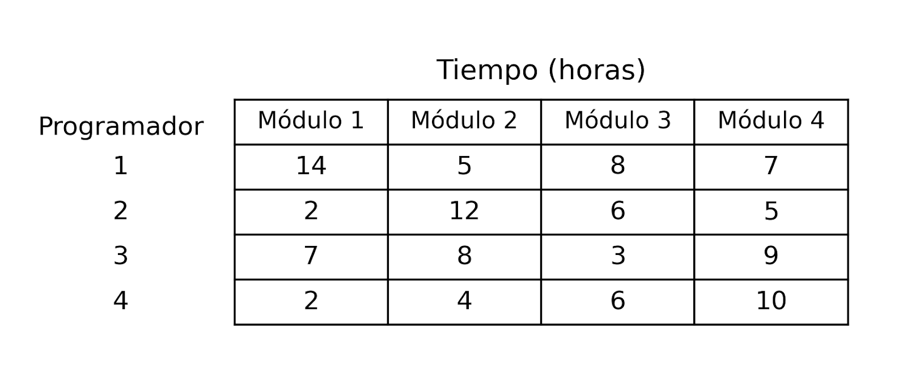
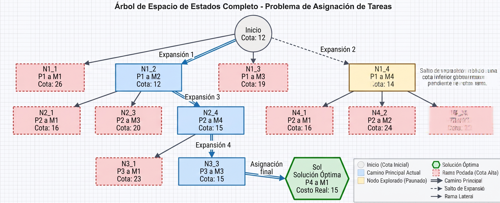
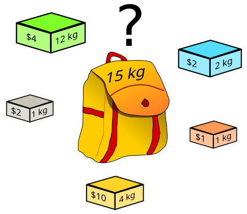

# TC2038 - Análisis y diseño de algoritmos avanzados
## Tema 1.5 Ramificación y Poda

**Profesor** - Alison Muñoz Capote  
**Computación - Facultad de Ingeniería**

---

# Mapa del Tema y Objetivos

<div class="info-box">

### Objetivos del Tema:
* **Comprender** la técnica de Ramificación y Poda para la resolución exacta de problemas de optimización combinatoria.

</div>

<div class="concept-box">

### Índice:
1. Conceptos Fundamentales de Ramificación y Poda.
2. Análisis de Complejidad (Temporal y Espacial).
3. Solución del _Problema de Asignación_ a detalle.
4. Ejercicios de Práctica.
5. Próximo tema: Manejo de Strings con KMP.

</div>

---
# 1. Introducción


---

# El Problema de Asignación

<div class="problem-box">

**Imagina esta situación:**
Eres el director de proyectos en una empresa de desarrollo de software. Tienes un equipo de $N$ programadores y exactamente $N$ módulos críticos (tareas) que deben desarrollarse.

Cada programador tiene diferentes habilidades y experiencia, por lo que el **costo** (o el tiempo) que le toma a cada uno completar cada tarea es diferente.

**La regla:** Debes asignar exactamente un trabajador a cada tarea, y cada tarea debe ser realizada por un solo trabajador.

**El objetivo:** ¿Cómo asignas las tareas para que el **costo total de desarrollo sea el mínimo posible**?

</div>



---

# Formalizando el problema

<div class="solution-box">

Esta situación se modela mediante una **Matriz de Costos** cuadrada de tamaño $N \times N$, donde la fila representa al trabajador y la columna a la tarea. El valor $C[i][j]$ es el costo de que el trabajador $i$ haga la tarea $j$.

**Modelo matemático:**
* **Minimizar:** 
  $$\sum_{i=1}^{N} \sum_{j=1}^{N} C[i][j] \cdot x_{ij}$$
* **Sujeto a (Restricciones):** 
  1. $\sum_{j=1}^{N} x_{ij} = 1$ (Cada trabajador hace exactamente una tarea)
  2. $\sum_{i=1}^{N} x_{ij} = 1$ (Cada tarea es hecha por exactamente un trabajador)
* **Donde:** $x_{ij} \in \{0, 1\}$ (Es una decisión binaria: se asigna o no se asigna).

</div>

---

# ¿Por qué no usar Fuerza Bruta?

<div class="alert-box">

El espacio de soluciones posibles para este problema corresponde a todas las permutaciones en las que podemos asignar a los trabajadores. Matemáticamente, esto es **$N!$ (N factorial)**.

* Si $N = 4$ trabajadores, hay $4! = 24$ asignaciones. (Muy fácil).
* Si $N = 10$, hay $10! = 3,628,800$ permutaciones.
* Si $N = 20$, hay $20! \approx 2.43 \times 10^{18}$ permutaciones. 

La fuerza bruta (generar todas las permutaciones y elegir la más barata) se vuelve computacionalmente intratable muy rápido. Necesitamos **Ramificación y Poda** para descartar inteligentemente combinaciones costosas sin siquiera evaluarlas.

</div>

---
# 2. Conceptos fundamentales

---

<div class="info-box">

# ¿Qué es Ramificación y Poda?

La técnica de **Ramificación y Poda** (*Branch and Bound*, **B&B**) es un paradigma de diseño de algoritmos estructurado para resolver problemas de optimización combinatoria y discreta.

A diferencia de la búsqueda exhaustiva (*Fuerza Bruta*) o el *Backtracking* clásico que exploran a ciegas, B&B es un **método de optimización inteligente**. 

Utiliza funciones heurísticas (matemáticas) para evaluar regiones enteras del espacio de búsqueda y descartar aquellas que sabemos que no pueden contener una solución óptima, ahorrando enormes cantidades de tiempo de cómputo.

</div>

---

# El Árbol del Espacio de Estados

<div class="info-box">

El funcionamiento de B&B se modela visual y conceptualmente como la construcción dinámica de un **árbol de espacio de estados**.

*   **Nodo Raíz:** Representa el problema original completo sin ninguna decisión tomada.
*   **Nodos Internos:** Representan estados parciales (decisiones intermedias tomadas hasta el momento).
*   **Nodos Hoja:** Representan soluciones completas (factibles o infactibles).
*   **Aristas (Ramas):** Representan la toma de una decisión discreta (ej. tomar o no tomar la tarea 1).

El objetivo del algoritmo es encontrar el nodo hoja con el valor óptimo, visitando la **menor cantidad de nodos** posible.

</div>

---



---

# Los Tres Pilares: Ramificación y Acotación

El algoritmo se sostiene en tres operaciones fundamentales. Las primeras dos son:

<div class="info-box">

1.  **Ramificación (*Branching*):** Es el proceso de dividir un problema grande en subproblemas más pequeños y mutuamente excluyentes. En nuestro árbol, equivale a tomar un nodo activo y generar sus nodos hijos (las siguientes decisiones posibles).
2.  **Acotación (*Bounding*):** Para cada nodo generado, calculamos una **cota** (límite o *bound*). 
    *   Es una estimación rápida del **mejor resultado posible** que podríamos obtener si seguimos explorando ese camino.
    *   Si buscamos minimizar (como en el Problema de Asignación), calculamos una cota inferior (*Lower Bound*).
    *   Si buscamos maximizar (como en el Problema de la Mochila), calculamos una cota superior (*Upper Bound*).

</div>

---

# Los Tres Pilares: La Poda (*Pruning*)

La tercera operación, y la que le da el poder al algoritmo, es el mecanismo de descarte.

<div class="info-box">

Durante la búsqueda, mantenemos registro de la **mejor solución encontrada hasta el momento** (conocida como la solución incumbente).

3.  **Poda (*Pruning*):** Al evaluar la cota de un nodo recién generado:
    *   Si su cota indica que el mejor escenario posible en esa rama es **peor o igual** a la solución que ya tenemos guardada... ¡Ese nodo se _poda_!
    *   Se descarta ese subárbol entero. Sabemos con certeza matemática que la solución óptima no está ahí, evitando explorar miles de combinaciones inútiles.

</div>

---

# Análisis de Complejidad (General de B&B)

El rendimiento de la técnica depende críticamente de la _calidad_ de la función de acotación.

<div class="info-box">

**Complejidad Temporal:**
*   **Peor caso:** $O(b^d)$ (donde $b$ es el factor de ramificación y $d$ la profundidad). Para decisiones binarias degenera a $O(2^n)$ si la cota es débil y no podamos nada.
*   **Caso Promedio:** Exponencialmente mejor que la fuerza bruta, dependiendo de qué tan rápido la heurística nos permita podar el espacio.

**Complejidad Espacial (Memoria):**
*   Depende de la estrategia de recorrido (Anchura, Profundidad, Menor Costo).
*   **Profundidad (LIFO):** $O(d)$ (muy eficiente en memoria).
*   **Menor Costo (Cola de prioridad):** $O(b^d)$ en el peor caso, ya que debemos mantener todos los nodos generados pero no explorados en memoria.

</div>

---

# 3. Solución del Problema Asignación


---

# B&B para Minimización

En el Problema de Asignación buscamos **minimizar** el costo. Por lo tanto, la estrategia sería:

<div class="solution-box">

* Mantenemos registro del **costo mínimo** encontrado hasta ahora (solución incumbente), inicializado en infinito ($\infty$).
* Para cada nodo, calculamos una **Cota Inferior (*Lower Bound*)**.
* Esta cota responde a la pregunta: *"Siendo súper optimistas, ¿cuál es el costo absoluto más barato que podría costar completar las asignaciones que faltan desde este punto?"*

</div>

---

# El Árbol del Espacio de Estados

<div class="solution-box">

¿Cómo estructuramos las decisiones para no repetir asignaciones?

* **Nivel del árbol:** Cada nivel $i$ (desde $0$ hasta $N-1$) representa a un **Trabajador**.
* **Ramas (Nodos Hijos):** Representan las **Tareas** que se le pueden asignar a ese trabajador.
* **Restricción de Ramificación:** Un trabajador solo puede ser asignado a una tarea que **no haya sido asignada** previamente a los trabajadores de los niveles superiores (ancestros en el árbol).

En la raíz no hay tareas asignadas. En el nivel 0, el Trabajador 0 tiene $N$ ramas (puede tomar cualquier tarea). En el nivel 1, el Trabajador 1 tiene $N-1$ ramas, y así sucesivamente.

</div>

---

# Diseño de la Solución: La Función de Acotación (Lower Bound)

<div class="solution-box">

La magia de este ejercicio está en su función de acotación, que es matemáticamente elegante pero muy fácil de calcular.

**¿Cómo calculamos la Cota Inferior de un nodo activo?**
1. Partimos del **costo acumulado real** de las tareas que ya asignamos en ese camino.
2. Para los **trabajadores restantes** (filas que faltan por procesar en la matriz):
   * Buscamos el costo **más barato** disponible en su fila (excluyendo, por supuesto, las **columnas/tareas** que ya fueron asignadas).
3. Sumamos el _costo acumulado_ + _la suma de los mínimos_ de las filas restantes.
4. El resultado es nuestro *Lower Bound*. ¡Es imposible que la asignación real final cueste menos que esto!

</div>

---

# El Mecanismo de Poda (Pruning)

<div class="solution-box">

Durante el recorrido del árbol, mantenemos nuestra variable `min_cost_global` (inicia en $\infty$).

Cada vez que llegamos a un nodo hoja (todos los trabajadores tienen tarea), comparamos el costo real de esa asignación con `min_cost_global` y nos quedamos con el menor.

**La Regla de Poda:**
Al generar un nuevo nodo hijo (una asignación parcial), calculamos su Cota Inferior.
* Si **`Cota Inferior` $\geq$ `min_cost_global`** $\rightarrow$ **¡PODAMOS LA RAMA!**
* Lógica: Si en el escenario más optimista y barato posible esta rama ya resulta más cara (o igual) que una solución completa que ya encontramos por otro lado, es inútil seguir explorándola.

</div>

---

# Análisis de Complejidad (Asignación B&B)

<div class="info-box">

**Complejidad Temporal:**
* **Cálculo de la cota por nodo:** $O(N^2)$ en el peor de los casos, ya que debemos buscar el mínimo en las filas restantes.
* **Nodos explorados (Peor caso):** $O(N!)$. Si la cota es débil o la matriz tiene valores muy similares, B&B degenera a la fuerza bruta.
* **Caso Promedio:** Si los costos tienen varianza, la poda es masiva y el tiempo se reduce a una fracción polinomial del tiempo original. (Nota: Para este problema en específico existe el *Algoritmo Húngaro* que lo resuelve en $O(N^3)$, pero B&B es el enfoque general cuando se añaden restricciones complejas).

**Complejidad Espacial (Memoria):**
* **Búsqueda por Menor Costo (LC - Cola de Prioridad):** $O(N!)$ en el peor caso de almacenamiento de nodos vivos.
* **Búsqueda en Profundidad (DFS - Pila):** $O(N^2)$ (profundidad máxima $N$ multiplicada por el tamaño de las matrices/estados almacenados por nodo). Mucho más amigable con la RAM.

</div>

---

## 4. Pseudocódigo: Estructuras de Datos

Para implementar este algoritmo, necesitamos una estructura que guarde el estado exacto de cada ruta explorada en el árbol.

**Estructura del Nodo del Árbol:**
```elixir
Clase Nodo:
    entero trabajador_id   // Nivel actual en el árbol (fila de la matriz)
    entero costo_real      // Costo acumulado de las asignaciones hasta ahora
    entero cota_inferior   // Límite inferior estimado (Lower Bound)
    lista asignadas        // Lista de booleanos indicando qué tareas ya se ocuparon

```

<div class="alert-box">

_Nota_: Aquí necesitamos la lista asignadas para saber exactamente qué columnas (tareas) de la matriz están bloqueadas para los siguientes trabajadores.

</div>

---

# Pseudocódigo: La Función de Acotación (Lower Bound)

Esta función calcula la estimación más optimista del costo restante.

```elixir

Función CalcularCota(matriz_costos, N, trabajador_actual, tareas_asignadas):
    cota = 0
    
    // Iterar sobre los trabajadores que AÚN NO tienen tarea
    Para cada fila i desde (trabajador_actual + 1) hasta (N - 1):
        min_fila = infinito
        
        // Buscar la tarea más barata disponible en esa fila
        Para cada columna j desde 0 hasta (N - 1):
            Si tareas_asignadas[j] es FALSO: // Si la tarea está libre
                Si matriz_costos[i][j] < min_fila:
                    min_fila = matriz_costos[i][j]
                    
        cota += min_fila // Sumamos el mejor caso de esta fila
        
    Retornar cota
```
---

# Pseudocódigo: El Algoritmo Principal (LC Search)

Para este problema, usaremos una Cola de Prioridad (Búsqueda por Menor Costo o LC Search), priorizando los nodos con la menor `cota_inferior`.

```elixir
Función AsignacionBB(matriz_costos, N):
    Crear Cola de Prioridad Min-Heap Q
    min_costo_global = infinito
    
    // Nodo Raíz ficticio (antes de asignar al trabajador 0)
    Nodo raiz = crearNodo(trabajador_id = -1, costo_real = 0, asignadas = vacía)
    raiz.cota_inferior = CalcularCota(matriz_costos, N, -1, raiz.asignadas)
    Q.insertar(raiz)
    
    Mientras Q no esté vacía:
        u = Q.extraer_minimo() // Sacamos el nodo con la cota más baja
        
        // Si la cota del nodo extraído ya es mayor que el óptimo, terminamos
        // (porque la cola de prioridad garantiza que no habrá nada mejor)
        Si u.cota_inferior >= min_costo_global:
            Romper ciclo 
            
        // ... (Continúa en la siguiente diapositiva con la ramificación)

```


---

# Pseudocódigo: Ramificación y Poda

Continuación del algoritmo principal (dentro del ciclo `Mientras`):

```elixir

// Ramificación: Asignar tareas al SIGUIENTE trabajador
        i = u.trabajador_id + 1
        
        Si i == N: Continuar // Ya se asignaron todos (hoja)
        
        // Crear un hijo por cada tarea disponible
        Para j desde 0 hasta N - 1:
            Si u.asignadas[j] es FALSO:
                Nodo hijo = crearNodo(i)
                hijo.asignadas = copia de u.asignadas, marcando j como VERDADERO
                hijo.costo_real = u.costo_real + matriz_costos[i][j]
                
                hijo.cota_inferior = hijo.costo_real + CalcularCota(...)
                
                Si i == N - 1: // Es una solución completa
                    min_costo_global = minimo(min_costo_global, hijo.costo_real)
                Sino: // Es una solución parcial
                    Si hijo.cota_inferior < min_costo_global:
                        Q.insertar(hijo) // No podar, aún es prometedor
                        
    Retornar min_costo_global

```
---

# Código Python: Clases y Estructuras

Iniciamos importando `heapq`, que es la implementación estándar de Python para colas de prioridad (Min-Heaps).

```python
import heapq
import copy
import math

class Node:
    def __init__(self, worker_id, assigned_tasks, cost, lower_bound):
        self.worker_id = worker_id
        self.assigned_tasks = assigned_tasks
        self.cost = cost
        self.lower_bound = lower_bound

    # Fundamental para heapq: Le dice a Python cómo comparar dos Nodos
    # para saber cuál tiene mayor prioridad (el de menor cota).
    def __lt__(self, other):
        return self.lower_bound < other.lower_bound
```

---
# Código Python: La Función de Acotación (Lower Bound)

Esta función calcula la suma de los costos mínimos posibles para los trabajadores que aún no han sido asignados a ninguna tarea.

```python

def calc_lower_bound(cost_matrix, N, worker_id, assigned_tasks):
    bound = 0
    # Iterar sobre los trabajadores restantes
    for i in range(worker_id + 1, N):
        min_val = math.inf
        # Buscar la tarea más barata disponible en esta fila
        for j in range(N):
            if not assigned_tasks[j]: # Si la tarea está libre
                if cost_matrix[i][j] < min_val:
                    min_val = cost_matrix[i][j]
        bound += min_val
        
    return bound

```
---

# Código Python: Inicialización del Algoritmo

Preparamos nuestra cola de prioridad y el nodo raíz que servirá como punto de partida para construir el árbol.

```python
def solve_assignment_bb(cost_matrix):
    N = len(cost_matrix)
    pq = [] # Nuestra cola de prioridad (Min-Heap)
    min_cost_global = math.inf
    
    # Estado inicial: Ningún trabajador asignado, ninguna tarea ocupada
    assigned_tasks = [False] * N
    
    # Nodo Raíz (worker_id = -1 significa que aún no evaluamos al trabajador 0)
    root = Node(-1, assigned_tasks, 0, 0)
    root.lower_bound = calc_lower_bound(cost_matrix, N, -1, assigned_tasks)
    
    heapq.heappush(pq, root)
    # ... (Continúa dentro del ciclo while)
```
---
# Código Python: Búsqueda y Poda Implícita

Extraemos siempre el nodo con el mejor futuro (menor límite inferior).

```python
# ... (Dentro de solve_assignment_bb)
    while pq:
        # Extraemos el nodo con el menor Lower Bound (LC Search)
        u = heapq.heappop(pq)
        
        # PODA IMPLÍCITA: Si la promesa (cota) de este nodo ya es peor
        # que nuestro costo mínimo encontrado real, lo descartamos.
        # (En LC Search, si el mejor nodo de la cola ya no sirve, 
        # significa que el resto de la cola tampoco servirá).
        if u.lower_bound >= min_cost_global:
            break
            
        next_worker = u.worker_id + 1
        if next_worker == N:
            continue # Ya evaluamos a todos en esta rama

```

---

# Código Python: Ramificación y Poda Explícita

Generamos las combinaciones válidas para el siguiente trabajador y podamos activamente antes de encolar.

```python
# Ramificación: Un hijo por cada tarea disponible
        for j in range(N):
            if not u.assigned_tasks[j]:
                # Copiamos el estado y marcamos la tarea 'j' como ocupada
                child_assigned = copy.deepcopy(u.assigned_tasks)
                child_assigned[j] = True
                
                child_cost = u.cost + cost_matrix[next_worker][j]
                child_bound = child_cost + calc_lower_bound(
                    cost_matrix, N, next_worker, child_assigned)
                
                # Si llegamos a una solución hoja completa
                if next_worker == N - 1:
                    min_cost_global = min(min_cost_global, child_cost)
                    
                # PODA EXPLÍCITA: Solo lo encolamos si promete ser mejor
                elif child_bound < min_cost_global:
                    child = Node(next_worker, child_assigned, child_cost, child_bound)
                    heapq.heappush(pq, child)
                    
    return min_cost_global

```

---

# Traza de Ejecución: Matriz de Ejemplo

Para entender la mecánica, vamos a resolver un problema pequeño. 
Tenemos 3 Trabajadores (T0, T1, T2) y 3 Tareas (A, B, C).

Nuestra **Matriz de Costos** es la siguiente:

| Trabajador | Tarea A | Tarea B | Tarea C |
| :--- | :---: | :---: | :---: |
| **T0** | 9 | **2** | 7 |
| **T1** | 6 | 4 | **3** |
| **T2** | 5 | 8 | **1** |

**Objetivo:** Encontrar la asignación global más barata.
**Variables Iniciales:** `min_costo_global` = $\infty$.

---

# Traza de Ejecución: El Nodo Raíz

<div class="info-box">

Comenzamos evaluando el **Nodo Raíz** (antes de hacer cualquier asignación).
Calculamos su Cota Inferior (Lower Bound) sumando el mínimo absoluto de cada fila.

*   Mínimo de T0: $2$ (Tarea B)
*   Mínimo de T1: $3$ (Tarea C)
*   Mínimo de T2: $1$ (Tarea C)

**Cota de la Raíz:** $2 + 3 + 1 =$ **$6$**
*(Nota didáctica: Fíjense que T1 y T2 "eligen" la misma tarea. Esto es una relajación inválida en la realidad, pero perfectamente válida para calcular una cota optimista).*

Insertamos la Raíz en la Cola de Prioridad (PQ). Estado de PQ: `[ (Cota: 6, Raíz) ]`

</div>

---

# Traza de Ejecución: Ramificando el Nivel 0

<div class="info-box">

Extraemos la Raíz. Evaluamos las opciones para el **Trabajador 0 (T0)**:

*   **Hijo 1 (T0 $\rightarrow$ A):** Costo = 9. Tareas libres: {B, C}.
    *   Cota = 9 + min(T1 en {B,C}) + min(T2 en {B,C}) = 9 + min(4,3) + min(8,1) = 9 + 3 + 1 = **13**.
*   **Hijo 2 (T0 $\rightarrow$ B):** Costo = 2. Tareas libres: {A, C}.
    *   Cota = 2 + min(T1 en {A,C}) + min(T2 en {A,C}) = 2 + min(6,3) + min(5,1) = 2 + 3 + 1 = **6**.
*   **Hijo 3 (T0 $\rightarrow$ C):** Costo = 7. Tareas libres: {A, B}.
    *   Cota = 7 + min(T1 en {A,B}) + min(T2 en {A,B}) = 7 + min(6,4) + min(5,8) = 7 + 4 + 5 = **16**.

</div>

---

# Traza de Ejecución: La Cola de Prioridad (LC Search)

<div class="info-box">

Insertamos los tres hijos generados en nuestra Min-Heap.
Estado de la Cola de Prioridad (ordenada por Cota):

1.  `[Cota: 6, Asignación: (T0->B)]`  $\leftarrow$ ¡El más prometedor!
2.  `[Cota: 13, Asignación: (T0->A)]`
3.  `[Cota: 16, Asignación: (T0->C)]`

La política **Least Cost (LC Search)** extrae el nodo superior. Vamos a expandir el camino donde el Trabajador 0 hace la Tarea B. Dejamos los otros dos nodos "congelados" en memoria por si acaso.

</div>

---

# Traza de Ejecución: Ramificando el Nivel 1

<div class="info-box">

Extraemos el Nodo `(T0->B)`. Evaluamos al **Trabajador 1 (T1)**. 
Las tareas disponibles son {A, C}.

*   **Hijo 2.1 (T1 $\rightarrow$ A):** Costo acumulado = 2 (de T0) + 6 = 8. Tareas libres: {C}.
    *   Cota = 8 + min(T2 en {C}) = 8 + 1 = **9**.
*   **Hijo 2.2 (T1 $\rightarrow$ C):** Costo acumulado = 2 (de T0) + 3 = 5. Tareas libres: {A}.
    *   Cota = 5 + min(T2 en {A}) = 5 + 5 = **10**.

**Nueva Cola de Prioridad:**
`[(Cota: 9), (Cota: 10), (Cota: 13), (Cota: 16)]`
El algoritmo seguirá por el camino de Cota 9. Al asignar el último trabajador, encontrará una solución completa con costo exacto de 9 y `min_costo_global` se actualizará, descartando el resto.

</div>

---

# 4. Solución del Problema de la Mochila

---


# El Problema de la Mochila

<div class="problem-box">

**Imagina esta situación:**
Eres un explorador que acaba de encontrar una bóveda con artículos valiosos. Tienes una mochila para llevarte el botín, pero esta mochila tiene una **capacidad máxima de peso ($W$)**. 

Frente a ti hay $n$ objetos. Cada objeto $i$ tiene:
* Un **peso** ($w_i$)
* Un **valor** monetario ($v_i$)

**El dilema:** No puedes llevarte todo. ¿Qué objetos eliges para que el valor total en tu mochila sea el **máximo posible** sin que se rompa por el exceso de peso?

</div>



---

# Formalizando el problema

<div class="solution-box">

Esta situación se conoce formalmente como el **Problema de la Mochila 0/1**. 
Se llama _0/1_ porque tienes una decisión binaria (discreta) para cada objeto:
* **1:** Tomas el objeto completo y lo metes a la mochila.
* **0:** Dejas el objeto. *(No puedes partir o fraccionar los objetos).*

**Modelo matemático:**
* **Maximizar:** 
  $$\sum_{i=1}^{n} v_i x_i$$
* **Sujeto a:** 
  $$\sum_{i=1}^{n} w_i x_i \leq W$$
* **Donde:** $x_i \in \{0, 1\}$

</div>

---


# ¿Por qué es un problema difícil?

<div class="info-box">

Para $n$ objetos, existen $2^n$ combinaciones posibles (subconjuntos).

* Si $n = 10$, hay $1,024$ combinaciones. (Muy rápido para una computadora).
* Si $n = 50$, hay $1,125,899,906,842,624$ combinaciones. (La fuerza bruta comienza a ser intratable).

Necesitamos un enfoque más inteligente que evaluar todas las combinaciones a ciegas. Aquí es donde entra la **Técnica de Ramificación y Poda**. Nos permitirá explorar el espacio de soluciones de forma estructurada e ignorar matemáticamente las opciones que sabemos que no serán óptimas.

</div>

---

# La Mochila 0/1 a Detalle: Análisis del Problema

<div class="solution-box">

Para resolver el problema de la Mochila 0/1 con B&B, debemos definir cómo estructurar nuestro espacio de búsqueda. 

*   **Estado inicial:** Una mochila vacía (peso acumulado = 0, beneficio acumulado = 0) y todos los $n$ objetos disponibles para elegir.
*   **Decisión:** Por cada nivel del árbol, tomamos un objeto $i$ y decidimos qué hacer con él.
*   **Restricción estricta:** En ningún momento el peso acumulado puede superar la capacidad máxima $W$. Si lo hace, ese camino es **infactible**.
*   **Meta:** Maximizar el beneficio. Necesitamos una heurística que nos diga _cuánto es lo máximo que podríamos ganar_ si seguimos por un camino.

</div>

---

# Diseño de la Solución: Ramificación (El Árbol Binario)

<div class="solution-box">

El árbol de espacio de estados para la Mochila 0/1 es un árbol binario perfecto en su concepción teórica.

*   **Nivel $i$ del árbol:** Corresponde a la toma de decisión sobre el objeto $i$ (desde $i = 0$ hasta $n-1$).
*   **Hijo Izquierdo (1):** Representa la decisión de **incluir** el objeto $i$ en la mochila.
    *   El peso acumulado aumenta en $w_i$.
    *   El beneficio acumulado aumenta en $v_i$.
*   **Hijo Derecho (0):** Representa la decisión de **NO incluir** el objeto $i$.
    *   El peso acumulado se mantiene igual.
    *   El beneficio acumulado se mantiene igual.

</div>

---

# Diseño de la Solución: La Función de Acotación (Bounding)

<div class="solution-box">

Para podar, necesitamos una cota superior (*Upper Bound*). ¿Cómo estimamos el máximo beneficio posible desde un nodo activo? **Usamos una relajación fraccional.**

1.  **Preparación:** Antes de empezar, ordenamos todos los objetos por su relación valor/peso ($v_i / w_i$) en orden descendente.
2.  **Cálculo de la cota:** Dado el beneficio y peso actual del nodo:
    *   Iteramos sobre los objetos restantes.
    *   Si el objeto cabe completo en el espacio restante de la mochila, lo sumamos al beneficio y actualizamos el espacio.
    *   Si el objeto **no cabe completo**, tomamos una **fracción** de él para llenar la mochila al 100% y sumamos esa fracción a su beneficio.
    *   Este valor final es nuestra **Cota Superior**.

</div>

---

# Diseño de la Solución: El Proceso de Poda

<div class="solution-box">

Durante la exploración del árbol, mantenemos una variable `max_profit` (beneficio máximo encontrado hasta el momento en un nodo válido). Inicialmente, `max_profit = 0`.

Al generar un nodo hijo, aplicamos dos reglas de poda:

1.  **Poda por Infactibilidad:** ¿El peso acumulado del nodo supera la capacidad $W$? 
    *   Sí $\rightarrow$ **Poda.** (Es físicamente imposible).
2.  **Poda por Cota (Optimalidad):** Calculamos la Cota Superior del nodo. ¿La cota es **menor o igual** al `max_profit` actual?
    *   Sí $\rightarrow$ **Poda.** (Incluso si llenamos el resto de la mochila con fracciones perfectas, nunca superaremos la solución que ya tenemos en las manos).

</div>

---

# Análisis de Complejidad Específico (Mochila 0/1 B&B)

<div class="solution-box">

**Complejidad Temporal:**
*   **Ordenar los objetos:** $O(n \log n)$.
*   **Cálculo del límite (Bound) por nodo:** $O(n)$ en el peor caso.
*   **Nodos explorados:** En el peor caso (si la cota no ayuda a podar), se generan $2^{n+1} - 1$ nodos.
*   **Tiempo total (Peor Caso):** $O(n \cdot 2^n)$. Sin embargo, en la práctica (Caso Promedio), la poda fraccional es tan fuerte que la complejidad real es drásticamente menor.

**Complejidad Espacial (Memoria):**
*   Si usamos Búsqueda en Anchura (Cola normal): $O(2^n)$ en el peor caso.
*   Si usamos Búsqueda en Profundidad (Pila): $O(n)$, ya que la profundidad máxima del árbol es $n$.  

</div>

---

# Pseudocódigo: Estructuras de Datos


Antes de escribir la lógica, necesitamos definir cómo representamos la información en memoria.

**Estructura del Objeto (Item):**
```elixir
Clase Item:
    entero peso
    entero valor
    real ratio = valor / peso
```

**Estructura del Nodo del Árbol:**

```elixir
Clase Nodo:
    entero nivel      // Índice del objeto actual (-1 para la raíz)
    entero beneficio  // Beneficio acumulado en este punto
    entero peso       // Peso acumulado en este punto
    real cota         // Límite superior calculado (Upper Bound)
```

---

# Pseudocódigo: La Función de Acotación (Bound)

Esta función calcula cuánto es lo máximo que podemos obtener a partir de un nodo dado.

```elixir
Función CalcularCota(nodo, W, items, n):
    Si nodo.peso >= W:
        Retornar 0 // Infactible
        
    cota_beneficio = nodo.beneficio
    peso_total = nodo.peso
    j = nodo.nivel + 1
    
    Mientras j < n y (peso_total + items[j].peso <= W):
        peso_total += items[j].peso
        cota_beneficio += items[j].valor
        j++
        
    Si j < n: // Tomar fracción del siguiente objeto
        cota_beneficio += (W - peso_total) * items[j].ratio
        
    Retornar cota_beneficio
```

---

# Pseudocódigo: El Algoritmo Principal (B&B)

```elixir
Función KnapsackBB(W, items, n):
    Ordenar items por 'ratio' descendente
    Crear Cola vacía Q
    Crear Nodo raiz u(nivel=-1, beneficio=0, peso=0)
    Q.encolar(u)
    max_profit = 0
    
    Mientras Q no esté vacía:
        u = Q.desencolar()
        Si u.nivel == n - 1: Continuar // Ya llegamos al fondo
        
        // Rama 1: Incluir objeto (nivel + 1)
        Nodo v = crear hijo incluyendo items[u.nivel + 1]
        Si v.peso <= W y v.beneficio > max_profit:
            max_profit = v.beneficio // Actualizar mejor solución
        v.cota = CalcularCota(v, W, items, n)
        Si v.cota > max_profit: Q.encolar(v) // No podar
            
        // Rama 2: No incluir objeto (nivel + 1)
        Nodo w = crear hijo SIN incluir items[u.nivel + 1]
        w.cota = CalcularCota(w, W, items, n)
        Si w.cota > max_profit: Q.encolar(w) // No podar
        
    Retornar max_profit
```
---

# Código Python: Clases Auxiliares

Empezaremos definiendo las clases que estructurarán nuestra información. Utilizamos la librería `collections.deque` para implementar nuestra cola de manera eficiente (Búsqueda en Anchura).

```python
from collections import deque

class Item:
    def __init__(self, weight, value):
        self.weight = weight
        self.value = value
        self.ratio = value / weight  # Crucial para la heurística

class Node:
    def __init__(self, level, profit, weight):
        self.level = level      # Índice del objeto (-1 para raíz)
        self.profit = profit    # Beneficio acumulado
        self.weight = weight    # Peso acumulado
        self.bound = 0.0        # Cota superior (Upper Bound)

```

---

# Código Python: La Función de Acotación

Esta función calcula la relajación fraccional (el máximo beneficio teórico que se podría alcanzar desde el nodo actual).

```python
def calculate_bound(node, n, W, items):
    if node.weight >= W:
        return 0 # Infactible
    
    profit_bound = node.profit
    totweight = node.weight
    j = node.level + 1 # Siguiente objeto
    
    # Tomar objetos completos mientras quepan
    while j < n and totweight + items[j].weight <= W:
        totweight += items[j].weight
        profit_bound += items[j].value
        j += 1
        
    # Si sobra espacio, tomar fracción del siguiente
    if j < n:
        profit_bound += (W - totweight) * items[j].ratio
        
    return profit_bound
```

---

# Código Python: Inicialización del Algoritmo

```python
def solve_knapsack_bb(W, weights, values, n):
    # Crear lista de objetos y ordenar por ratio descendente
    items = [Item(weights[i], values[i]) for i in range(n)]
    items.sort(key=lambda x: x.ratio, reverse=True)
    
    q = deque()
    # Nodo raíz: nivel -1, sin beneficio, sin peso
    u = Node(-1, 0, 0)
    q.append(u)
    
    max_profit = 0
    
    # Iniciar ciclo de exploración
    while q:
        u = q.popleft()
        
        # Si estamos en el último nivel, continuar
        if u.level == n - 1:
            continue
```

---

# Código Python: Ramificación (Hijo Izquierdo)

Dentro del ciclo `while`, evaluamos qué pasa si INCLUIMOS el siguiente objeto.

```python

# (Dentro del while...)
        # --- HIJO IZQUIERDO: Incluir objeto ---
        next_level = u.level + 1
        v = Node(next_level, 
                 u.profit + items[next_level].value, 
                 u.weight + items[next_level].weight)
        
        # ¿Es factible y mejora la solución actual?
        if v.weight <= W and v.profit > max_profit:
            max_profit = v.profit
            
        # Calcular cota y decidir si podamos
        v.bound = calculate_bound(v, n, W, items)
        if v.bound > max_profit:
            q.append(v) # Aún es prometedor, se encola

```

---

# Código Python: Ramificación (Hijo Derecho)

Finalmente, evaluamos qué pasa si **NO INCLUIMOS** el objeto, y terminamos el algoritmo.

```python
# (Dentro del while...)
        # --- HIJO DERECHO: No incluir objeto ---
        v2 = Node(next_level, u.profit, u.weight)
        
        # Calcular cota y decidir si podamos
        v2.bound = calculate_bound(v2, n, W, items)
        if v2.bound > max_profit:
            q.append(v2) # Aún promete superar el máximo, se encola
            
    # Al vaciarse la cola, tenemos la respuesta óptima garantizada
    return max_profit

# Ejecución:
# solve_knapsack_bb(10, [2, 3.14, 1.98, 5, 3], [40, 50, 100, 95, 30], 5)

```

---

# Traza de Ejecución: Estado Inicial

<div class="info-box">

Para entender verdaderamente el algoritmo, veamos cómo se comportan las variables en un caso real. 
Supongamos $W = 10$ y los siguientes objetos ya ordenados por su ratio (valor/peso):

1. **Objeto A:** Peso = 2, Valor = 40 (Ratio = 20)
2. **Objeto B:** Peso = 5, Valor = 95 (Ratio = 19)
3. **Objeto C:** Peso = 3, Valor = 30 (Ratio = 10)

**Inicialización:**
* `max_profit` = 0
* **Nodo Raíz ($U$):** Nivel = -1, Peso = 0, Beneficio = 0
* Cola activa: `[ Raíz ]`

</div>

---

# Traza de Ejecución: Ramificando el Nivel 0 (Objeto A)

<div class="info-box">

Extraemos la Raíz de la cola. Evaluamos el Objeto A.

**Hijo Izquierdo (INCLUIR A):**
* `peso` = 0 + 2 = 2. (`2 <= 10`, es factible).
* `beneficio` = 0 + 40 = 40. (Como 40 > `max_profit`, ahora **`max_profit` = 40**).
* `cota` = 40 (A) + 95 (B) + (3/3)*30 (C) = 165.
* Como 165 > 40, encolamos el nodo.

**Hijo Derecho (NO INCLUIR A):**
* `peso` = 0, `beneficio` = 0.
* `cota` = 95 (B) + (5/3)*30 (C) = 145.
* Como 145 > 40, encolamos el nodo.

</div>

---

# Traza de Ejecución: El Poder de la Poda

<div class="info-box">

Imagina que avanzamos en el árbol y llegamos a un nodo $X$ en el nivel 2 (hemos decidido no incluir ni A ni B).
* `max_profit` actual es **135** (logrado en otra rama tomando A y B).
* **Nodo $X$:** `peso` = 0, `beneficio` = 0.

Calculamos su cota para ver si vale la pena explorar qué pasa con el Objeto C:
* `cota(X)` = (espacio restante: 10). Tomamos C completo: beneficio = 30. No hay más objetos.
* `cota(X)` = **30**.

**Decisión de Poda:** ¿30 > `max_profit` (135)? **NO.**
$\rightarrow$ ¡Se poda la rama! Ni siquiera generamos los hijos de $X$, ahorrando tiempo de procesamiento.

</div>

---

# 5. Estudio independiente

---

# Ejercicios Prácticos: Tarea 1

<div class="problem-box">

**Problema:** El código Python visto en clase utiliza una cola regular (`deque`), lo que resulta en una búsqueda en anchura (FIFO). Esto puede consumir demasiada memoria en instancias grandes. 

Tu misión es **modificar el código fuente proporcionado** para implementar una política de **Búsqueda por Mejor Cota** (*Best-First Search* o LC Search).

El algoritmo modificado debe seleccionar siempre, de entre todos los nodos activos en memoria, aquel que tenga la **Cota Superior (*Upper Bound*) más prometedora** (la más alta).

</div>

---

# Ejercicio 1: Tips de Solución

<div class="info-box">

1. **Estructura de Datos:** Reemplaza `collections.deque` por el módulo `heapq` de la biblioteca estándar de Python.
2. **Min-Heap a Max-Heap:** Por defecto, `heapq` implementa un *Min-Heap* (saca el elemento menor). Como en la mochila buscamos *maximizar*, queremos extraer el nodo con el límite **mayor**. *Tip: Puedes insertar las cotas multiplicadas por `-1` en la cola, o modificar la clase.*
3. **Métodos Mágicos (Recomendado):** Para que `heapq` sepa cómo comparar tus nodos, sobreescribe el método `__lt__(self, other)` en tu clase `Node`. 
   * *Ejemplo:* `return self.bound > other.bound`
4. **Métricas:** Imprime un contador de "nodos generados". Tu nueva versión debería explorar estrictamente menos nodos que la versión FIFO que vimos en clase.

</div>

---

# Más Allá de FIFO: Políticas de Ramificación

<div class="info-box">

Para entender la Tarea 2, comparemos las 3 formas clásicas de recorrer el árbol:

1. **FIFO (Anchura):** Explora nivel por nivel. Encuentra soluciones completas muy tarde, por lo que la poda tarda en activarse. Usa mucha memoria.
2. **LIFO (Profundidad - *Backtracking*):** Se sumerge rápidamente hasta las hojas. Encuentra una solución factible muy rápido (estableciendo un `max_profit` temprano), lo que ayuda a podar fuertemente las otras ramas. Usa muy poca memoria.
3. **LC (Menor Costo / Mejor Cota):** Utiliza una cola de prioridad. Siempre explora el nodo que tiene el mejor futuro matemático, saltando entre ramas según convenga.

</div>

---

# El Compromiso de LC Search (Trade-offs)

<div class="info-box">

Si la Búsqueda por Mejor Cota (LC) explora la menor cantidad de nodos posibles... ¿Por qué no usarla siempre?

**Ventaja (Eficiencia de Espacio de Estados):** 
* Te lleva a la solución óptima (o a demostrar que ya la tienes) por el camino más corto posible, podando masivamente.

**Desventaja (Overhead de Estructura de Datos):** 
* Mantener una cola de prioridad ordenada tiene un costo computacional logarítmico $O(\log N)$ por cada inserción y extracción. 
* En problemas donde tu cota es "débil", gastarás más tiempo reordenando la cola de prioridad que el tiempo que ahorrarías explorando los nodos.

</div>

---

# Resumen del Tema: Ramificación y Poda

<div class="solution-box">

* Es un método **exacto**, no heurístico (a diferencia de los algoritmos genéticos). Siempre garantiza encontrar la solución óptima real.
* La clave del éxito está en la **Cota (Bound)**. Una cota muy relajada (que sobreestima demasiado) no podará nada y el algoritmo degenerará a $O(2^n)$.
* Una cota muy ajustada y rápida de calcular podará ramas masivas del árbol desde los primeros niveles.
* Es el motor intelectual detrás de la mayoría de los *solvers* comerciales modernos de optimización matemática e Inteligencia Artificial.

</div>

---

# Próximo Tema: Búsqueda y Manejo de Cadenas

<div class="problem-box">

En nuestra próxima sesión cambiaremos de paradigma. Dejaremos atrás la optimización combinatoria para entrar al fascinante mundo de los **Algoritmos sobre Cadenas de Texto (*Strings*)**.

El problema central que abordaremos será el del *Pattern Matching* (Búsqueda de Patrones): Dada una cadena de texto $T$ de longitud $n$ y un patrón $P$ de longitud $m$, ¿cómo encontramos todas las ocurrencias de $P$ dentro de $T$ de la manera más rápida posible?

Las aplicaciones de esto son inmensas: desde el `Ctrl+F` en tu editor de código o procesador de textos, hasta el análisis de secuencias de ADN en bioinformática.

</div>

---

# Introducción al Algoritmo KMP

<div class="info-box">

Para resolver el problema anterior, la fuerza bruta compara carácter por carácter, retrocediendo ineficientemente cuando hay un fallo (Complejidad $O(n \times m)$).

La próxima clase estudiaremos el **Algoritmo Knuth-Morris-Pratt (KMP)**.
* Fue publicado en 1977 por Donald Knuth, Vaughan Pratt y James H. Morris.
* Su magia radica en que **nunca retrocede** en la cadena de texto original.
* Logra una complejidad de tiempo lineal **$O(n + m)$**.
* Lo hace analizando previamente el patrón para saber exactamente cuánto puede "saltar" hacia adelante cuando ocurre una discrepancia.

</div>

---

# Lectura Previa Obligatoria (Tarea 2)

<div class="problem-box">

Para aprovechar la próxima clase, es indispensable que vengan familiarizados con el concepto matemático que hace posible el algoritmo KMP.

**Lectura Asignada:**
Investiguen el concepto de la **Función de Prefijo** (también conocida como arreglo $\pi$ o arreglo LPS: *Longest Proper Prefix which is also Suffix*).

**Preguntas guía para su lectura:**
1. ¿Qué es un prefijo propio y un sufijo en una cadena?
2. ¿Cómo se construye la tabla LPS para la palabra "ABABCABAB"?
3. ¿Por qué preprocesar el patrón nos ahorra comparaciones redundantes?

</div>

---

# 10. Conclusiones Generales

<div class="solution-box">

Volviendo al tema de hoy, recordemos nuestros puntos clave:

1. **Ramificación y Poda (B&B)** es la herramienta definitiva para cuando la Programación Dinámica falla por falta de memoria, y los algoritmos genéticos no nos sirven porque necesitamos la solución *exacta*.
2. Diseñar una buena heurística para la **Cota Superior/Inferior** es el 90% del trabajo.

</div>