# TC2038 - Análisis y diseño de algoritmos avanzados
## Grafos y Tries

**Profesor** - Alison Muñoz Capote  
**Computación - Facultad de Ingeniería**

---

# Mapa del Tema y Objetivos

<div class="info-box">

### Objetivos de la Sesión:
1. **Comprender** la topología de red y sus componentes.
2. **Dominar** las estructuras de representación en memoria (Matrices y Listas de Adyacencia).
3. **Implementar** algoritmos de Grafos.
4. **Entender** y **codificar** la estructura del Árbol Trie.

</div>

<div class="concept-box">

### Índice:
1. Concepto de Grafo
2. Propiedades y Representación en Memoria
3. Implementación de Grafos en Código
4. El Árbol Trie
5. Implementación de Tries en Código

</div>

---
# 0. Observaciones del período 1
---

# Orientaciones para el período 2

<div class="info-box">

1. Respetar las orientaciones sobre la estructura y restricciones de la solución al problema.
2. Utilizar la IA como **SOPORTE** y no como sustituto de su aprendizaje. Se penalizará el uso inadecuado de la IA en la solución de sus tareas.

</div>

<div style="display: grid; grid-template-columns: repeat(3, 1fr); gap: 15px; font-size: 0.65em;">
<div>

### Columna 1
```python
def kmp(text: str, pattern: str) -> list[int]:
    if not text:
        return []

    _lps = lps(pattern)

    if not _lps:
        return []

    j = 0

    _kmp = []

    for i in range(len(text)):
        while j > 0 and text[i] != pattern[j]:
            j = _lps[j - 1]
        if text[i] == pattern[j]:
            j += 1

        if j == len(pattern):
            _kmp.append(i - j + 1)
            j = _lps[j - 1]
    return _kmp
```
</div>
<div>

### Columna 2
```python
def kmp(text: str, pattern: str) -> list[int]:
    if not text or not pattern:
        return []

    lps_array = compute_lps(pattern)
    matches = []
    j = 0

    for i, char in enumerate(text):
        while j > 0 and char != pattern[j]:
            j = lps_array[j - 1]
            
        if char == pattern[j]:
            j += 1

        if j == len(pattern):
            matches.append(i - j + 1)
            j = lps_array[j - 1]
            
    return matches
```

</div>
<div>

### Columna 3
```python
def shift_and_match(text: str, pattern: str):
    m = len(pattern)
    if not m or not text:
        return

    # 1. Precomputación: Máscaras de bits O(M + Σ)
    # Cada caracter del alfabeto obtiene un entero donde los bits en 1 
    # representan sus posiciones dentro del patrón.
    char_masks = {}
    for i, char in enumerate(pattern):
        char_masks[char] = char_masks.get(char, 0) | (1 << i)

    # El bit más significativo que indica que el patrón completo ha coincidido
    match_mask = 1 << (m - 1)
    
    # Estado inicial del autómata en un solo registro numérico
    state = 0

    # 2. Búsqueda: O(N) estricto. Sin bucles anidados ni backtracking.
    for i, char in enumerate(text):
        # state << 1: Avanza todos los prefijos posibles un paso
        # | 1: Permite que inicie una nueva coincidencia potencial
        # & char_masks: Filtra las transiciones válidas para el caracter actual
        state = ((state << 1) | 1) & char_masks.get(char, 0)
        
        # Si el bit en la posición m-1 es 1, llegamos al estado de aceptación
        if state & match_mask:
            yield i - m + 1
```

</div>
</div>

---

# 1. Concepto de Grafo

---

# ¿Qué es un grafo?

<div class="solution-box">

Una red de conexiones. Modela relaciones complejas donde no existe una jerarquía estricta (a diferencia de los árboles tradicionales).

</div>

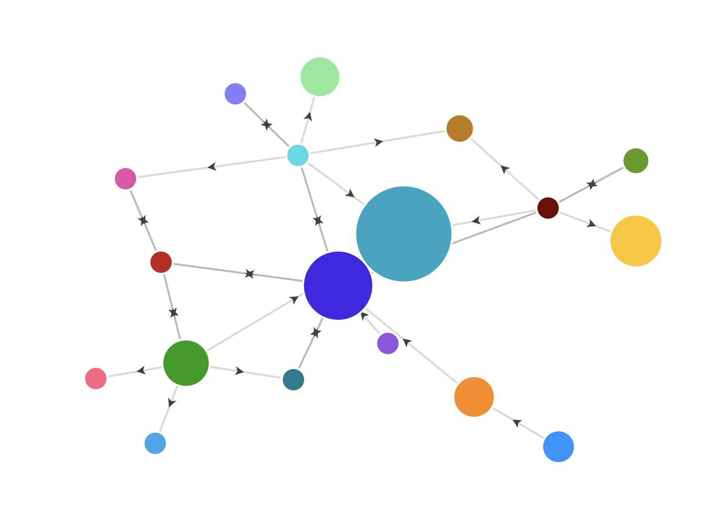

---

# Componentes Principales: Vértices

<div class="info-box">

También conocidos como nodos. Son las entidades fundamentales que almacenan la información.

</div>

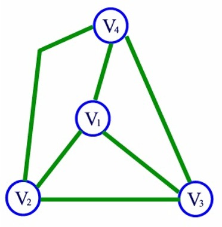

---

# Componentes Principales: Aristas

<div class="info-box">

También conocidas como enlaces (edges). Son las conexiones tangibles que unen a los vértices.

</div>


---

# La Fórmula Fundamental

<div class="info-box">

$G = (V, E)$

Un Grafo (G) es un conjunto de Vértices (V) y un conjunto de Aristas (Edges).

</div>

---

# Tipos de Grafos: No Dirigido

<div class="info-box">

Las relaciones son simétricas o bidireccionales por defecto. Una conexión entre A y B se puede recorrer en ambos sentidos.

</div>

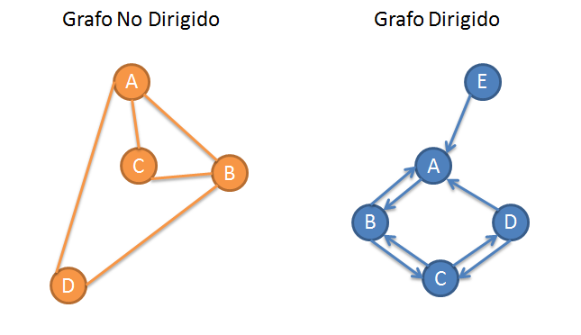

---

# Tipos de Grafos: Dirigido

<div class="info-box">

Las conexiones son unidireccionales. Si hay una arista de D hacia A, no implica que exista de A hacia D.

</div>


---

# Tipos de Grafos: Ponderado

<div class="info-box">

Cada arista contiene un _peso_. Este peso puede representar costo, distancia, tiempo o capacidad.

</div>

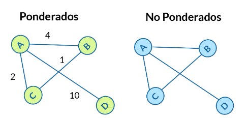

---

# Tipos de Grafos: No Ponderado

<div class="info-box">

Todas las conexiones tienen un costo unitario idéntico. Solo importa si existe o no la conexión.

</div>


---

# Topología: Ciclos

<div class="info-box">

Un ciclo es una ruta que comienza y termina en el mismo vértice, permitiendo recorrer un bucle infinito.

</div>

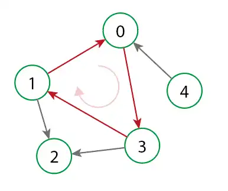

---

# Topología: Acíclicos

<div class="info-box">

Redes estrictamente sin bucles ni retornos posibles. Una vez que se avanza, no se puede regresar al origen.

</div>


---

# DAG

<div class="info-box">

**Directed Acyclic Graph (Grafo Acíclico Dirigido).**
Es la base algorítmica para la resolución de dependencias, como en los gestores de paquetes o sistemas de compilación.

</div>


---

# Aplicaciones Reales

<div class="info-box">

* Redes sociales (amigos, seguidores).

* Sistemas GPS y mapas (rutas más cortas).

* Motores de recomendación.

* Topología de redes de computadoras.

</div>

<div style="text-align: center; margin-top: 30px;">

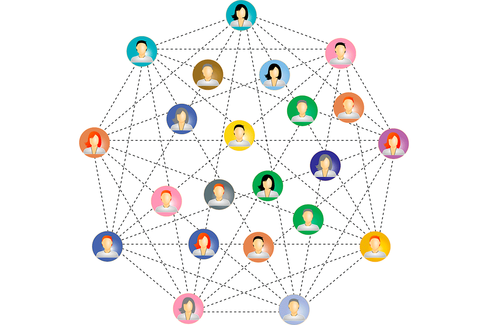 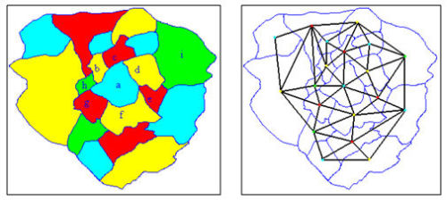 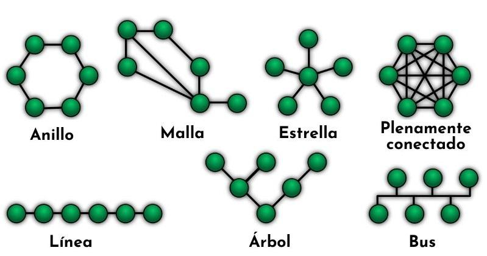

</div>

---

# 2. Propiedades y Memoria

---

# El Desafío de la Memoria

<div class="problem-box">

¿Cómo almacenamos topologías irregulares e interconectadas en una memoria de computadora que es lineal?

</div>

---

# Matriz de Adyacencia

<div class="info-box">

Una cuadrícula 2D (matriz cuadrada) que marca con un 1 la existencia de conexiones directas y con un 0 la ausencia de ellas.

</div>

---

# Matriz de Adyacencia: Visualización

|  | A | B | C | 
 | ----- | ----- | ----- | ----- | 
| A | 0 | 1 | 0 | 
| B | 1 | 0 | 1 | 
| C | 0 | 1 | 0 | 

---

# Complejidad Espacial de la Matriz

<div class="info-box">

 * $O(V^2)$

Complejidad cuadrática. Es muy costosa en redes grandes porque reserva memoria incluso para conexiones que no existen.

</div>

---

# Lista de Adyacencia

<div class="info-box">

Un mapa, diccionario o arreglo donde cada vértice almacena únicamente una lista de sus vecinos directos.

</div>

---

# Lista de Adyacencia: Visualización

<div class="info-box">

* **A** $\rightarrow$ \[B\]

* **B** $\rightarrow$ \[A, C\]

* **C** $\rightarrow$ \[B\]

</div>

---

# Complejidad Espacial de la Lista

<div class="info-box">

* $O(V + E)$

Complejidad lineal. Altamente eficiente ya que solo ocupa memoria proporcional a las entidades y conexiones reales.

</div>

---

# ¿Cuándo usar Matriz?

<div class="info-box">

**Grafos Densos:** Cuando casi todas las conexiones posibles entre vértices existen. Las operaciones de consulta son $O(1)$.

</div>

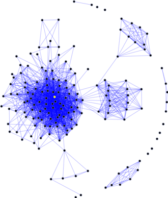

---

# ¿Cuándo usar Lista?

<div class="info-box">

**Grafos Dispersos:** Cuando hay pocos enlaces por nodo (la mayoría de los casos reales). Ahorra cantidades masivas de memoria.

</div>

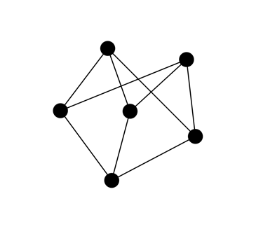

---

# 3. Grafos en Código

---

# Implementación: Estructura Base

```python
class Grafo:
    def __init__(self):
        # Utilizamos un diccionario para la Lista de Adyacencia
        self.adyacencia = {}

```

---

# Implementación: Insertando Entidades

```python
    def agregar_vertice(self, v):
        if v not in self.adyacencia:
            self.adyacencia[v] = []

```

---

# Implementación: Creando Enlaces

```python
    def agregar_arista(self, origen, destino):
        # Grafo dirigido
        self.adyacencia[origen].append(destino)
        
        # Si fuera NO dirigido, agregamos también:
        self.adyacencia[destino].append(origen)

```

---

# Recorridos de un Grafo

<div class="info-box">

Algoritmos para visitar y explorar cada nodo del grafo sistemáticamente sin entrar en ciclos infinitos.

</div>

---

# BFS (Búsqueda en Anchura)

<div class="info-box">

Exploración expansiva nivel por nivel. Ideal para encontrar la ruta más corta en grafos no ponderados.

</div>

<div class="alert-box">

**Criterios**

1. Pesos uniformes en las aristas (para pesos no uniformes se utiliza el algoritmo de _Dijkstra_).
2. Control obligatorio de nodos visitados.
3. Cobertura de componentes desconectadas.
4. Estructura de datos y consumo de memoria (Cola FIFO).
5. Dirección de las aristas.

</div>

---

# BFS

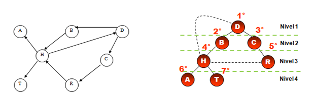


---

# BFS: Implementación (Usando Cola)

```python
from collections import deque

def bfs(grafo, inicio):
    visitados = set()
    cola = deque([inicio])
    
    while cola:
        nodo = cola.popleft()
        if nodo not in visitados:
            visitados.add(nodo)
            cola.extend(grafo[nodo])

```

---

# DFS (Búsqueda en Profundidad)

<div class="info-box">

Exploración ramificada hasta el fondo. Avanza lo más lejos posible por una rama antes de retroceder (_backtracking_).

</div>

<div class="alert-box">

**Criterios**

1. Estructura de Datos (LIFO).
2. Sin garantía de ruta más corta.
3. Control estricto de nodos y estados (detección de ciclos).
4. Ideal para orden topológico (DAG) y componentes conexas (algoritmos _Tarjan_ o _Kosaraju_).
5. Consumo de memoria según la profundidad.
6. Cobertura de componentes aisladas.

</div>

---

# DFS

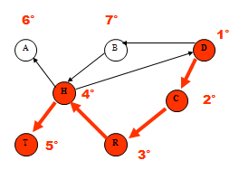

---

# DFS: Implementación (Recursividad/Pila)

```python
def dfs(grafo, inicio, visitados=None):
    if visitados is None:
        visitados = set()
        
    visitados.add(inicio)
    
    for vecino in grafo[inicio]:
        if vecino not in visitados:
            dfs(grafo, vecino, visitados)
            
    return visitados

```

---

# 4. El Árbol Trie

---

---

# ¿Qué es un Trie?

<div class="solution-box">

También llamado *Prefix Tree* (Árbol de Prefijos).
Es un tipo especial de árbol n-ario optimizado específicamente para almacenar y buscar cadenas de texto (_strings_).

</div>

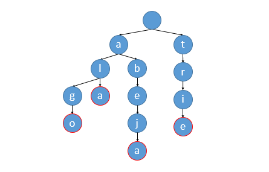

---

# Propiedad Fundamental

<div class="info-box">

A diferencia de los árboles de búsqueda binaria, los nodos no almacenan la clave entera. Cada nodo representa **un único caracter o letra**.

</div>


---

# Rutas Compartidas

<div class="info-box">

Las palabras que comparten un mismo prefijo comparten también los mismos nodos iniciales en la estructura de memoria.

*Ejemplo: `gato` y `ganar` comparten la `g` y la `a`.*

</div>


---

# Complejidad Temporal del Trie

<div class="info-box">

* $O(L)$

La búsqueda es extremadamente veloz y solo depende de la longitud $L$ de la palabra que estamos buscando, independientemente de cuántos millones de palabras existan en el árbol.

</div>


---

# Casos de Uso Reales

<div class="info-box">

  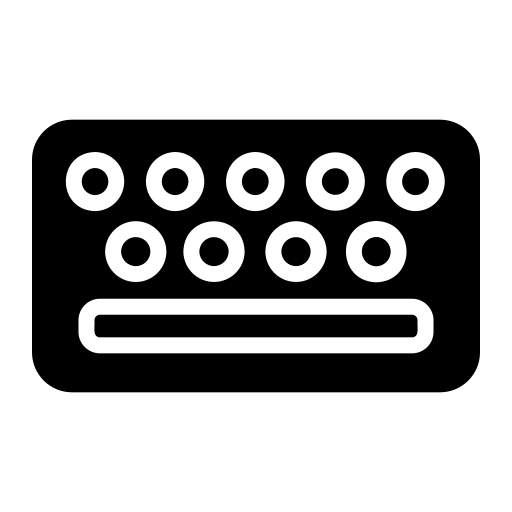 Autocompletado predictivo en buscadores. 

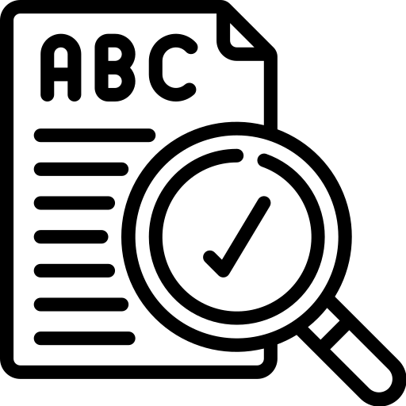 Correctores ortográficos.

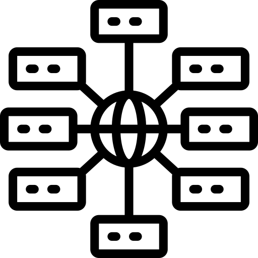 Enrutamiento de direcciones IP en redes.

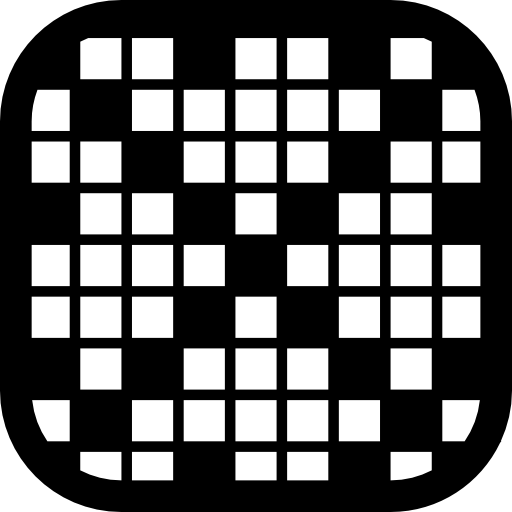 Juegos como Scrabble o Boggle.

</div>

---

# 5. Tries en Código

---

# El Nodo Trie

<div class="info-box">

Cada nodo debe tener referencias a sus hijos y una bandera booleana para indicar si ahí termina una palabra válida.

</div>

```python
class NodoTrie:
    def __init__(self):
        self.hijos = {} # Diccionario letra -> NodoTrie
        self.fin_palabra = False

```

---

# La Clase Trie

```python
class Trie:
    def __init__(self):
        # La raíz siempre es un nodo vacío
        self.raiz = NodoTrie()

```

---

# Inserción de Palabras

```python
    def insertar(self, palabra):
        nodo = self.raiz
        for char in palabra:
            if char not in nodo.hijos:
                nodo.hijos[char] = NodoTrie()
            nodo = nodo.hijos[char]
        
        # Marcamos el último nodo como fin de palabra
        nodo.fin_palabra = True

```

---

# Búsqueda de Palabras Exactas

```python
    def buscar(self, palabra):
        nodo = self.raiz
        for char in palabra:
            if char not in nodo.hijos:
                return False
            nodo = nodo.hijos[char]
            
        return nodo.fin_palabra

```

---

# Búsqueda de Prefijos (Autocompletado)

```python
    def empieza_con(self, prefijo):
        nodo = self.raiz
        for char in prefijo:
            if char not in nodo.hijos:
                return False
            nodo = nodo.hijos[char]
            
        return True # Si llegamos aquí, el prefijo existe

```

---

# Resumen Final

<div class="alert-box">

* **Grafos:** Flexibilidad total para modelar relaciones. Optimizados con listas de adyacencia.

* **Tries:** Estructura rígida pero inigualable en velocidad y memoria para manejar prefijos y diccionarios de texto.

</div>

