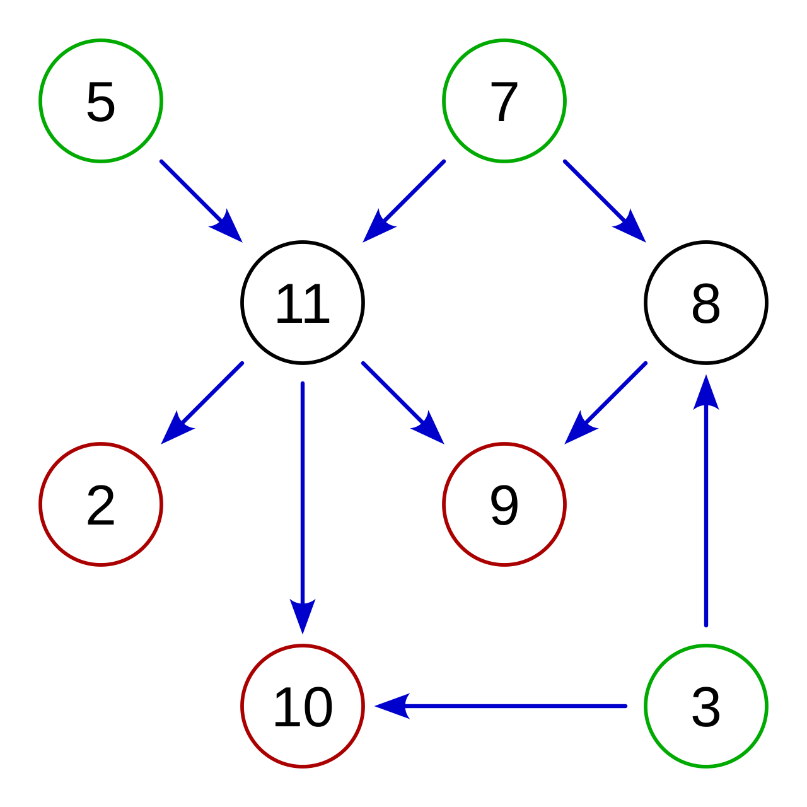
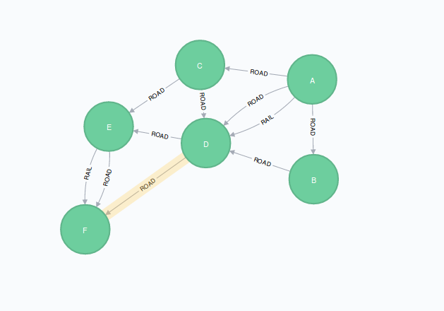
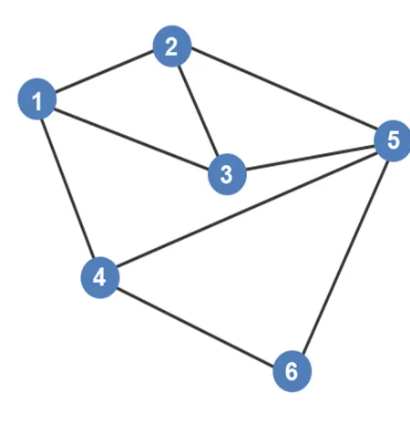
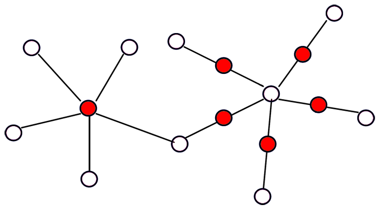
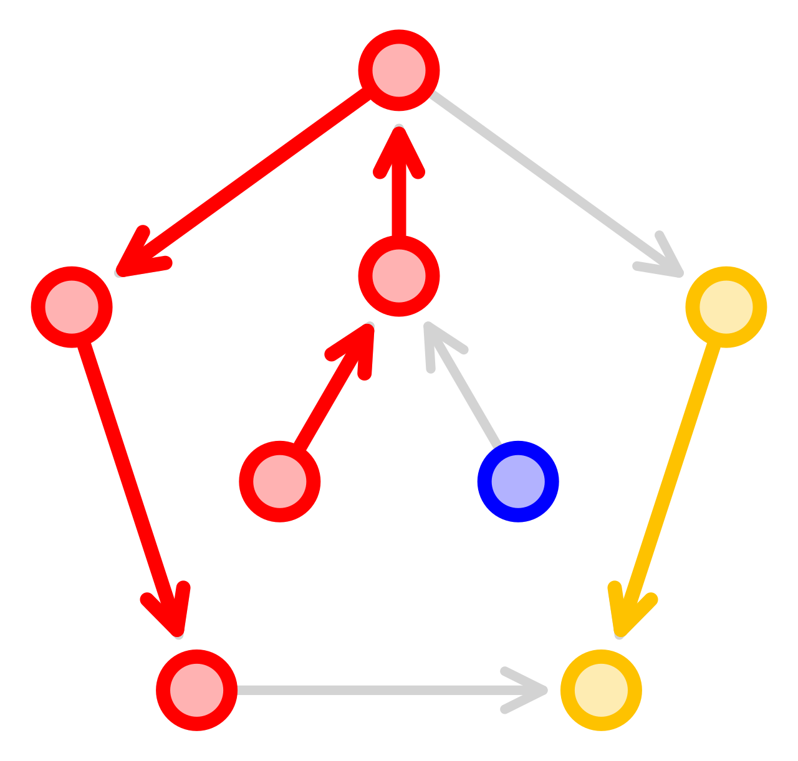
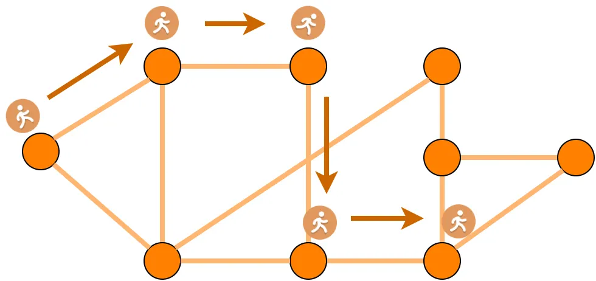
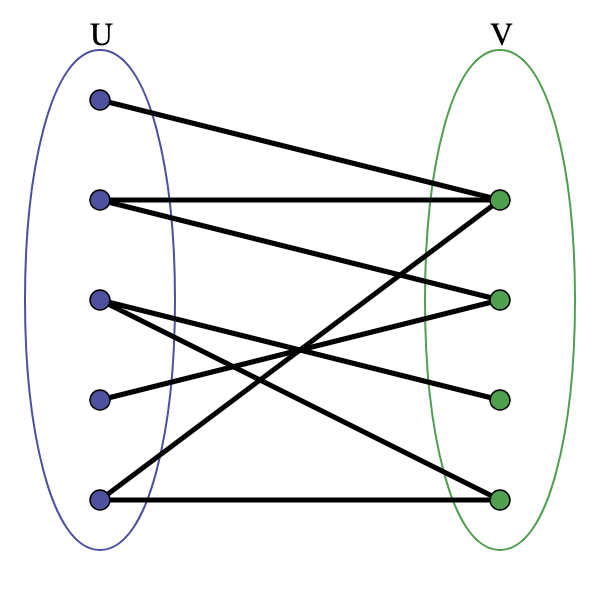

# TC2038 - Análisis y diseño de algoritmos avanzados
## Cobertura Mínima de Rutas en un Grafo Dirigido Acíclico

**Profesor** - Alison Muñoz Capote  
**Computación - Facultad de Ingeniería**

---

# Mapa del Tema y Objetivos

### Objetivo de la Sesión:
Comprender a profundidad el problema de la **Cobertura Mínima de Rutas en un Grafo Dirigido Acíclico (DAG)**, dominando la transformación algorítmica para su resolución y explorando sus aplicaciones prácticas en diferentes industrias de la tecnología.

### Índice:
1. Conceptos Fundamentales (Grafos y DAGs)
2. El Problema Central: Minimum Path Cover
3. La Solución y Transformación Bipartita
4. Teorema de Dilworth (Teoría Profunda)
5. Aplicación Extendida 1: Bioinformática
6. Aplicación Extendida 2: Testing de Software
7. Conclusiones y Q&A

---
# 1. Introducción
---
# El Caos de la Última Milla

**Situación Problema**

Imagina que eres el **Director de Operaciones Logísticas** de un gigante del e-commerce (como Amazon o MercadoLibre). 

Tienes miles de paquetes que deben entregarse hoy. Cada paquete tiene una ubicación específica, pero además existen **dependencias lógicas**:
* El paquete A (insumos) debe entregarse *antes* que el paquete B (maquinaria).
* El paquete C debe entregarse *antes* que el D.

---

# El Desafío Logístico

**Restricciones:** Tienes reglas de orden estrictas que no se pueden violar.

**El Objetivo:** Contratar el número **mínimo exacto** de camiones para realizar todas las entregas cumpliendo las dependencias.

**El Riesgo:** 
  * Si contratas de más $\rightarrow$ Pierdes rentabilidad.
  * Si contratas de menos $\rightarrow$ Incumples entregas y pierdes clientes.

---

# El Fracaso del Enfoque Ingenuo

Asignar camiones _al ojo_, usando el sentido común o heurísticas simples (ej. "enviar el camión al punto más cercano"), genera cuellos de botella y vehículos ociosos.

Se requiere un **modelo matemático exacto** para garantizar la optimización absoluta de la flota. 

**_Aquí es donde entra la teoría de grafos._**

---

# Modelando el Problema

Para resolver esto con matemáticas, traducimos la realidad a un modelo abstracto:

* Las entregas son **Vértices** (Nodos).
* Las dependencias temporales ("A antes que B") son **Aristas** dirigidas.
* Un camión realizando una secuencia válida de entregas es una **Ruta** (Path).

**Nuestra misión matemática:** Encontrar la Cobertura Mínima de Rutas.

---

# La solución no es tan trivial

* A $\rightarrow$ B
* C $\rightarrow$ B
* C $\rightarrow$ D

Nuevamente, escoger sin un mecanismo bien establecido (modelo), podría arruinar la solición *óptima*.

Por ejemplo, si elegimos C $\rightarrow$ B, tendríamos que usar 3 camiones para abarcar todos los nodos. La solución ópitima es: A $\rightarrow$ B, C $\rightarrow$ D.

¿Observan algo **extraño** en esta solución?

---

# 2. Conceptos Fundamentales

---

# ¿Qué es una Ruta?

En el contexto de un DAG, una ruta es una secuencia de vértices conectados por aristas dirigidas consecutivas.

* **Ejemplo:** $A \rightarrow D \rightarrow F$.
* **En nuestra logística:** Representa el recorrido completo y ordenado de la jornada de un solo camión.

---

# El Concepto de Cobertura

Decimos que un conjunto de rutas _cubre_ el grafo si **cada vértice** del grafo original pertenece a **al menos una** de esas rutas.

* No puede quedar ningún vértice aislado. 
* Significado práctico: Toda entrega debe asignarse a un camión; ninguna tarea puede quedar sin hacer.

 

---

# El Problema Central

**Minimum Path Cover (MPC)**

Dada la red (DAG), debemos encontrar el **número mínimo de rutas disjuntas** requeridas para cubrir todos y cada uno de los vértices del grafo.

*Queremos minimizar el costo (rutas/camiones) garantizando el servicio (cobertura total).*

  

---

# Variante 1: Vértices Disjuntos

En esta variante, cada vértice pertenece a **exactamente una** ruta. 
Los caminos no se cruzan ni comparten nodos.

* (Ej: Un paquete solo es procesado por un camión).
* Matemáticamente: Es resoluble en tiempo polinomial (pertenece a la Clase **P**).
* **_Esta es la variante en la que nos centraremos._**

---

# Variante 2: Vértices No Disjuntos

Las rutas pueden sobreponerse y compartir vértices (ej: dos rutas de bus que pasan por la misma parada).

**¿Cómo se resuelve?**
Se calcula el *Cierre Transitivo* del grafo (añadiendo aristas directas entre nodos y sus descendientes indirectos) y luego se aplica el mismo algoritmo de vértices disjuntos.

Esta variante queda de **_Estudio Independiente**_.

---

# La Solución: Reducción del Problema

**¿Cómo resolvemos computacionalmente el MPC en un DAG?**

La genialidad de este algoritmo es que **no resuelve el problema directamente**. Usa una técnica llamada *reducción*: transforma el DAG en un problema diferente que ya sabemos cómo resolver muy rápido.

Lo transformamos en un **Emparejamiento Máximo Bipartito**.

---

# Paso 1: División de Vértices

Por cada vértice $v$ en el DAG original, lo _partimos_ y creamos **dos** vértices virtuales en un nuevo grafo completamente vacío:

1. Un nodo de **Salida**: $v_{out}$
2. Un nodo de **Entrada**: $v_{in}$

Si el DAG tenía 5 nodos, el nuevo grafo tendrá 10 nodos.

---

# Paso 2: El Grafo Bipartito Resultante

Organizamos nuestros nuevos nodos en dos columnas:
* **Conjunto Izquierdo ($L$):** Todos los nodos $v_{out}$.
* **Conjunto Derecho ($R$):** Todos los nodos $v_{in}$.

Se llama _Bipartito_ porque las aristas **solo** pueden conectar el lado izquierdo con el derecho. Jamás nodos del mismo lado.

---

# Paso 3: Traducción de Aristas

Ahora, miramos el DAG original. Por cada arista dirigida $(U \rightarrow V)$ que exista en el DAG:

Trazamos una arista no dirigida desde $U_{out}$ (en la columna izquierda) hasta $V_{in}$ (en la columna derecha) en nuestro nuevo grafo bipartito.

---

# ¿Qué es un Grafo Bipartito?

**Definición Matemática**

Un grafo no dirigido $G = (V_e, E)$ es bipartito si su conjunto total de vértices $V_e$ puede dividirse en dos subconjuntos completamente disjuntos, digamos $U$ y $V$, cumpliendo una regla estricta:

* **Toda arista en $E$ conecta un vértice de $U$ con un vértice de $W$.**

$$U ∩ W = ∅$$

**En palabras simples para ingeniería:** 
Tenemos dos _bandos_ distintos. Las relaciones o conexiones solo están permitidas cruzando de un bando al otro. Es computacionalmente **imposible** que dos nodos del mismo conjunto se conecten entre sí.

---

# Propiedades y Casos de Uso del Grafo Bipartito

**La Prueba de los Dos Colores:**
La forma algorítmica de validar si cualquier grafo es bipartito es recorrerlo asignando colores alternos (ej. Blanco y Negro) a los nodos vecinos. Si logras colorear todo el grafo sin que dos nodos conectados compartan el mismo color, el grafo es bipartito (y no contiene ciclos de longitud impar).

**Ejemplos Clásicos de Modelado:**
* **Sistemas de Asignación:** Conjunto $U$ (Desarrolladores) emparejados con Conjunto $W$ (Tickets de Jira).
* **Motores de Recomendación:** Conjunto $U$ (Usuarios) interactuando con Conjunto $W$ (Películas).
* **Nuestra Reducción del DAG:** El conjunto izquierdo agrupa todos los nodos **de salida** ($V_{out}$) y el derecho todos los nodos **de entrada** ($V_{in}$).

---

# ¿Qué es un Emparejamiento (Matching)?

En teoría de grafos, un *matching* es un conjunto de aristas donde **ningún par de aristas comparte un vértice**. 

Son parejas completamente exclusivas y monogámicas. Nadie comparte nodos.

---

# Paso 4: Maximum Bipartite Matching

Nuestro objetivo en el nuevo grafo bipartito es encontrar el **Emparejamiento Máximo**.

Buscamos seleccionar la mayor cantidad posible de estas aristas exclusivas. 

Para resolver esto eficientemente, la informática utiliza algoritmos clásicos y súper optimizados.

---

# El Algoritmo de Hopcroft-Karp

Es el estándar de oro para encontrar el emparejamiento máximo bipartito. Funciona buscando _caminos aumentantes_ alternantes.

* **Complejidad Temporal:** $\mathcal{O}(\vert{}E\vert{} \sqrt{\vert{}V\vert{}})$.
* Es sumamente rápido y nos garantiza la respuesta óptima.

---

# Conectando el **Matching** con las **Rutas**

¿Qué significa realmente emparejar $U_{out}$ con $V_{in}$?

Significa hacer una declaración: *_El nodo U será seguido inmediatamente por el nodo V en la misma ruta_*.

Al emparejarlos, estamos **fusionando** lo que antes eran dos rutas separadas en una sola ruta más larga.

---

# La Fórmula Mágica

Una vez que el algoritmo termina, el tamaño de la cobertura mínima de rutas (MPC) se calcula con una simple resta:

MPC = |V| - M

Donde:
$\vert{}V\vert{}$ = Número total de vértices en el DAG original.
$M$ = Número de aristas en el emparejamiento máximo encontrado.

---

# ¿Por qué funciona esta resta? 

1.  Imagina el caso base: Emparejamiento $M = 0$. Tenemos $\vert{}V\vert{}$ rutas de un solo nodo (cada paquete requiere su propio camión).
2. Cada vez que logramos agregar una arista al emparejamiento ($M+1$), unimos dos caminos. 
3. El número total de rutas independientes en el universo se reduce exactamente en 1.
4. Por tanto: **Maximizar $M$ minimiza las rutas resultantes.**

---

# Profundidad Teórica: Teorema de Dilworth

Este algoritmo no es un truco casual; se apoya en un resultado profundo de la matemática combinatoria (Teoría de Órdenes Parciales):

**_En cualquier orden parcial finito, el tamaño de la partición mínima en cadenas (rutas) es exactamente igual al tamaño de la máxima anticadena._**

---

# ¿Qué es una Anticadena?

* Es un conjunto de vértices donde **ninguno es alcanzable** desde otro vértice del mismo conjunto.
* Representan tareas mutuamente independientes que *no pueden* hacerse secuencialmente. Deben hacerse en paralelo.
* El tamaño de la mayor anticadena se llama **Anchura del DAG**.

Dilworth nos dice: *No puedes tener menos caminos que tu cuello de botella más ancho de tareas simultáneas.*

---

# Resolución del Problema Inicial 🚛✅

Volvemos a nuestra logística e-commerce:

1. Modelamos las miles de entregas como un DAG.
2. Dividimos vértices (in/out) y creamos el grafo bipartito.
3. Ejecutamos Hopcroft-Karp en milisegundos.
4. Aplicamos $\vert{}V\vert{} - M$.

**Resultado:** Sabemos matemáticamente el número exacto de camiones a contratar hoy, y las aristas emparejadas nos dan la ruta exacta de cada chofer. Cero desperdicio.

---

# 2. Problemas de estudio independiente 

---

# Aplicación Adicional 1: Bioinformática

**El Ensamblaje Genómico**
Cuando secuenciamos ADN en un laboratorio, las máquinas no leen el cromosoma entero. Producen millones de _reads_ (fragmentos pequeños de texto genético).

Debemos reconstruir (ensamblar) la secuencia original como un rompecabezas.

---

# Grafos en el ADN

* Los fragmentos pequeños son **nodos**. 
* Si el final del fragmento A hace _match_ con el inicio del B, creamos una **arista**.
* El resultado es un inmenso DAG genético.
* Calcular el Minimum Path Cover nos da la menor cantidad de cadenas continuas (*contigs*) necesarias para explicar todos los fragmentos, reconstruyendo el genoma de forma óptima.

---

# Aplicación Adicional 2: Testing de Software 

**Garantía de Calidad y Flujos de Ejecución**
Un bloque de código complejo con condicionales (`if`/`else`), bucles desenrollados y bloques `try/catch` crea múltiples bifurcaciones lógicas.

El _Control Flow Graph_ de cualquier función determinista sin bucles infinitos es, en esencia, un DAG.

---

# Cobertura de Caminos en Testing

* Como ingenieros QA, queremos escribir la menor cantidad de scripts de pruebas automatizados.
* Pero necesitamos asegurar que **cada instrucción del código** sea ejecutada y evaluada al menos una vez para evitar bugs en producción.
* Aplicar Minimum Path Cover al grafo de control nos da el conjunto mínimo exacto de *Test Cases* necesarios para lograr el 100% de cobertura de instrucciones.

---

# Conclusiones

1. El *Minimum Path Cover* nos enseña que a veces la mejor forma de resolver un problema complejo es **traducirlo** a un problema que la humanidad ya sabe resolver rápido (Bipartite Matching).
2. La fórmula $\vert{}V\vert{} - M$ demuestra la elegancia y la simplicidad oculta en la teoría de grafos.
3. Lo que parece un problema abstracto de matemáticas, hoy rutea nuestros paquetes, secuencia nuestro ADN y testea el software de nuestros teléfonos.

---
# Complemento de la clase: Algoritmo de Hopcroft-Karp
---

# El Motor Oculto: Algoritmo de Hopcroft-Karp

**¿Cómo encontramos el Emparejamiento Máximo?**

Una vez que tenemos nuestro grafo bipartito ($U$ y $W$), necesitamos emparejar la mayor cantidad de nodos posible. 

Hopcroft-Karp es el algoritmo más eficiente para grafos bipartitos no ponderados.
* **Complejidad Temporal:** $\mathcal{O}(|E| \sqrt{|V|})$
* **Estrategia Core:** En lugar de buscar caminos de mejora uno por uno, los busca en lotes utilizando Búsqueda a lo Ancho (BFS) y Búsqueda en Profundidad (DFS) en tándem.

---

# El Concepto Clave: Caminos Aumentantes

Un **camino aumentante** es una ruta en el grafo que:
1. Comienza en un nodo libre (sin pareja) en $U$.
2. Alterna estrictamente entre aristas *no emparejadas* y *emparejadas*.
3. Termina en un nodo libre en $W$.

**La Magia:** Si invertimos el estado de todas las aristas en este camino (las emparejadas se liberan y las libres se emparejan), ¡el número total de parejas en el grafo aumenta exactamente en uno!

---

# ¿Cómo funciona Hopcroft-Karp? (El Ciclo)

El algoritmo divide el trabajo en **fases**. Cada fase tiene dos pasos fundamentales:

**Paso 1: Búsqueda a lo Ancho (BFS)**
Iniciamos un BFS simultáneo desde *todos* los nodos libres en $U$. 
El objetivo no es emparejar aún, sino construir un "grafo de capas" o niveles. El BFS se detiene en el nivel exacto donde encuentra los primeros nodos libres en $W$. Esto nos dice la longitud del camino aumentante *más corto* disponible.

---

# El Ciclo de Hopcroft-Karp (Continuación)

**Paso 2: Búsqueda en Profundidad (DFS)**
Usando el "grafo de capas" construido por el BFS, lanzamos un DFS para encontrar el número máximo de caminos aumentantes *independientes* (que no compartan vértices) de esa longitud exacta.

Por cada camino encontrado, aplicamos el "volteo" de aristas, sumando múltiples nuevos emparejamientos de un solo golpe.

**Terminación:** El ciclo BFS $\rightarrow$ DFS se repite. Cuando el BFS no puede encontrar ningún camino hacia un nodo libre en $W$, el algoritmo termina. El emparejamiento es el máximo posible.

---

# ¿Por qué es importante Hopcroft-Karp?

Para los futuros ingenieros en computación, este algoritmo demuestra un principio de diseño crítico:

**Combinar dos técnicas simples (BFS para estructurar la exploración y DFS para ejecutar la actualización) puede reducir la complejidad asintótica de un problema masivo, transformando soluciones teóricas en herramientas viables para la industria.**

