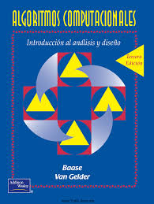
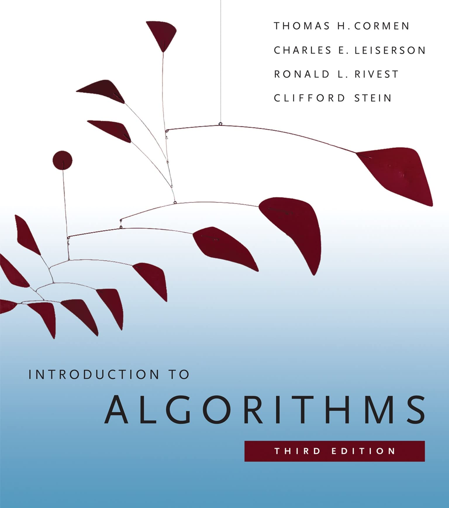
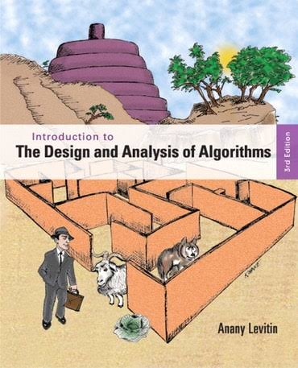

# TC2038 - Análisis y diseño de algoritmos avanzados
## Introducción a la Asignatura

Profesor: Alison Muñoz Capote  
Computación - Facultad de Ingeniería

---

# Mapa del Tema y Objetivos

### Objetivos de la Sesión Introductoria:
1. Comprender la metodología de **Aula Invertida**, **Aprendizaje Colaborativo** y el flujo de trabajo.
2. Analizar el plan de evaluación, ponderaciones, políticas de entrega y uso ético de la **IA**.
3. Conocer las fuentes bibliográficas, el sistema de **asesorías** y la motivación real del curso.
4. Introducir los conceptos clave del **Capítulo 1 de Baase** sobre Análisis y Diseño de Algoritmos.

### Índice de la Presentación:
1. **Forma de Trabajo y Cronograma** (Semanas 1 a 17)
2. **Plan de Evaluación y Quizzes** (Ponderaciones y Evidencias)
3. **Puntualidad y Reserva de Asesorías** (Horarios y Citas)
4. **Bibliografía Oficial y Matriz por Capítulo** (Libro Base y Consultas)
5. **Uso Responsable de la Inteligencia Artificial** (Reglas y Autoría)
6. **Motivación:** Casos de Impacto Real en la Industria
7. **Introducción Teórica:** Análisis y Diseño de Algoritmos (Capítulo 1)

---

# Forma de Trabajo: Estructura y Didáctica

La unidad de formación **TC2038** consta de **5 módulos** orientados al diseño y optimización de algoritmos avanzados.

### Pilares Metodológicos:

* **Aula Invertida (Flipped Classroom):**
  Revisión previa e individual de materiales, lecturas y videos asignados antes de cada sesión presencial.
* **Aprendizaje Colaborativo:**
  Trabajo activo en equipo para resolver actividades prácticas y **Situaciones Problema** aplicadas a contextos reales.

---

# Forma de Trabajo: Secuencia de Aprendizaje

  

    <strong>1. Teoría</strong> Conceptos por el profesor
  

  
➔

  

    <strong>2. Prog. Guiada</strong> En grupo con el profesor
  

  
➔

  

    <strong>3. Prog. Autónoma</strong> Ejercicios indiv./equipo
  

  
➔

  

    <strong>4. Solución SP</strong> Trabajo colaborativo
  

  
➔

  

    <strong>5. Defensa</strong> Presentación del proyecto
  

<strong>Regla Estricta - Defensa Individual:</strong> Durante la presentación, cada integrante del equipo responderá interrogantes individuales y defenderá partes específicas de la propuesta de solución.

---

# Cronograma de Actividades: Semanas 1 a 8

| Semana | Sesión 1 | Sesión 2 |
| :---: | :--- | :--- |
| **1** | Presentación del curso - Intro a Técnicas de Diseño | Divide y vencerás - Programación Dinámica |
| **2** | Programación Dinámica - Algoritmos Avaros | Backtracking |
| **3** | Ramificación y poda - **Situación Problema 1** | KMP - Z function |
| **4** | Manacher (palíndromo más largo) | Hash strings - Suffix Array |
| **5** | Longest Common Substring - Intro Grafos / Tries | **Entrega Actividad Integradora 1** |
| **6** | *Semana Tec* | *Semana Tec* |
| **7** | Retroalimentación AI1 - Ruta mínima en DAG | Dijkstra y Floyd (camino más corto) |
| **8** | Mochila y Viajero | Prim / Kruskal (Árbol de mínima extensión) |

---

# Cronograma de Actividades: Semanas 9 a 17

| Semana | Sesión 1 | Sesión 2 |
| :---: | :--- | :--- |
| **9** | ABB óptimo (Gilbert and Moore) | Coloreo de grafos |
| **10** | Flujo máximo - **Situación Problema 2** | Geometría computacional (Proximidad) |
| **11** | Voronoi y triangulación de Delaunay | Búsqueda geométrica |
| **12** | *Semana Tec* | *Semana Tec* |
| **13** | Arreglos de hiperplanos | Cascos convexos, politopos |
| **14** | Algoritmos aleatorizados - **Entrega AI2** | Búsqueda avanzada |
| **15** | Retroalimentación AI2 - Bitmask / Poda | Meet in the middle |
| **16** | Búsqueda A* e IDA* - Hill-climbing | Simulated annealing |
| **17** | Reflexiones finales | Retroalimentación y cierre |

---

# Plan de Evaluación: Esquema General

El sistema de evaluación combina tareas formativas y sumativas con evidencias integradoras para la demostración de subcompetencias.

### Distribución General de la Calificación (100%):
- **Tareas Evaluativas y Actividades (45%):**
  - Actividades de aprendizaje independiente por Módulo (5 módulos × 7% = 35%)
  - Evaluaciones de conceptos teóricos / Quizzes (10%)
- **Evidencias del Logro de Competencias (55%):**
  - Actividad Integradora 1 - Situación Problema 1 (20%)
  - Actividad Integradora 2 - Situación Problema 2 (25%)
  - Póster Argumentativo de Reflexión y Exposición (10%)

---

# Tareas Evaluativas por Módulo (45%)

Las tareas evaluativas permiten consolidar el dominio procedimental y conceptual de forma progresiva:

| Componente | Descripción del Componente | Ponderación |
| :--- | :--- | :---: |
| **Módulo 1** | Tareas de programación (Divide y vencerás, PD, Avaros, Backtracking, Poda) | **7%** |
| **Módulo 2** | Tareas de programación en cadenas (Hash Strings, Suffix Array) | **7%** |
| **Módulo 3** | Tareas de algoritmos sobre grafos (Tries, Dijkstra, Floyd, Mochila, Coloreo) | **7%** |
| **Módulo 4** | Tareas de geometría computacional (Proximidad, Polígonos, Búsqueda, Random) | **7%** |
| **Módulo 5** | Tareas de búsqueda avanzada (Bitmask, Meet in middle, A*, Heurísticas) | **7%** |
| **Quizzes** | 5 Evaluaciones conceptuales rápidas al cierre de cada módulo | **10%** |

---

# Actividades de Aprendizaje Independiente

### Desglose de Implementaciones Requeridas por Módulo:

- **Módulo 1:** Act. 1.1 Divide y vencerás | Act. 1.2 Prog. Dinámica y Avaros | Act. 1.3 Backtracking y Poda.
- **Módulo 2:** Act. 2.1 Hash String | Act. 2.2 Suffix Array.
- **Módulo 3:** Act. 3.1 Tries | Act. 3.2 Dijkstra y Floyd | Act. 3.3 Knapsack | Act. 3.4 Graph Coloring.
- **Módulo 4:** Act. 4.1 Intersección/Proximidad | Act. 4.2 Polígonos Convexos | Act. 4.3 Búsqueda Geométrica | Act. 4.4 Randomized Search.
- **Módulo 5:** Act. 5.1 Knight’s Tour | Act. 5.2 Bitmask | Act. 5.3 Poda Pesada | Act. 5.4 Meet in the middle | Act. 5.5 A* | Act. 5.6 & 5.7 Hill-Climbing / Simulated Annealing.

---

# Estrategia y Aplicación de Quizzes (10%)

Se aplicarán **5 Quizzes individuales (2% c/u = 10%)** al finalizar cada módulo para asegurar la comprensión teórica previa:

| Quiz | Módulo Evaluado | Momento de Aplicación | Enfoque Evaluativo |
| :---: | :--- | :--- | :--- |
| **Quiz 1** | Módulo 1: Técnicas de Diseño | **Final de Semana 3** | Análisis de complejidad y estrategias de diseño |
| **Quiz 2** | Módulo 2: Manejo de Strings | **Final de Semana 5** | Algoritmos de patronaje y estructuras de texto |
| **Quiz 3** | Módulo 3: Grafos y Optimización | **Final de Semana 9** | Rutas cortas, árboles mínimos y flujo |
| **Quiz 4** | Módulo 4: Geometría Computacional | **Final de Semana 13** | Algoritmos geométricos y cascos convexos |
| **Quiz 5** | Módulo 5: Búsqueda Avanzada | **Final de Semana 16** | Búsqueda heurística, A* y metaheurísticas |

---

# Evidencias Integradoras y Competencias (55%)

### Evidencias Principales de la Unidad de Formación:

- **E1. Actividad Integradora 1 (20%):** Solución y defensa de la **Situación Problema 1** (Semana 5). Evalúa el diseño e implementación de algoritmos en técnicas básicas y cadenas.
- **E2. Actividad Integradora 2 (25%):** Solución y defensa de la **Situación Problema 2** (Semana 14). Demuestra la integración compleja de grafos, optimización y geometría.
- **E3. Póster Argumentativo y Exposición (10%):** Exposición reflexiva sobre la eficiencia, sustentabilidad y desempeño de las soluciones desarrolladas (Semana 17).

---

# Políticas de Retroalimentación y Canvas

### Lineamientos de Evaluación y Comunicación:
- **Gestión Oficial en Canvas:** Todas las actividades, rúbricas de evaluación y calificaciones numéricas finales se administrarán formalmente en Canvas.
- **Retroalimentación Continua:** Se proporcionará retroalimentación durante la interacción presencial en clase y en cada módulo para corregir errores durante el proceso de aprendizaje.
- **Condición de Defensa:** La nota final de las actividades integradoras tomará en cuenta la argumentación individual durante las preguntas en la presentación del equipo.

---

# Plan de Evaluación: Esquema General

El sistema de evaluación combina tareas formativas y sumativas con evidencias integradoras para la demostración de subcompetencias.

### Distribución General de la Calificación (100%):
- **Tareas Evaluativas y Actividades (45%):**
  - Actividades de aprendizaje independiente por Módulo (5 módulos × 7% = 35%)
  - Evaluaciones de conceptos teóricos / Quizzes (10%)
- **Evidencias del Logro de Competencias (55%):**
  - Actividad Integradora 1 - Situación Problema 1 (20%)
  - Actividad Integradora 2 - Situación Problema 2 (25%)
  - Póster Argumentativo de Reflexión y Exposición (10%)

---

# Tareas Evaluativas por Módulo (45%)

Las tareas evaluativas permiten consolidar el dominio procedimental y conceptual de forma progresiva:

| Componente | Descripción del Componente | Ponderación |
| :--- | :--- | :---: |
| **Módulo 1** | Tareas de programación (Divide y vencerás, PD, Avaros, Backtracking, Poda) | **7%** |
| **Módulo 2** | Tareas de programación en cadenas (Hash Strings, Suffix Array) | **7%** |
| **Módulo 3** | Tareas de algoritmos sobre grafos (Tries, Dijkstra, Floyd, Mochila, Coloreo) | **7%** |
| **Módulo 4** | Tareas de geometría computacional (Proximidad, Polígonos, Búsqueda, Random) | **7%** |
| **Módulo 5** | Tareas de búsqueda avanzada (Bitmask, Meet in middle, A*, Heurísticas) | **7%** |
| **Quizzes** | 5 Evaluaciones conceptuales rápidas al cierre de cada módulo | **10%** |

---

# Actividades de Aprendizaje Independiente

### Desglose de Implementaciones Requeridas por Módulo:

- **Módulo 1:** Act. 1.1 Divide y vencerás | Act. 1.2 Prog. Dinámica y Avaros | Act. 1.3 Backtracking y Poda.
- **Módulo 2:** Act. 2.1 Hash String | Act. 2.2 Suffix Array.
- **Módulo 3:** Act. 3.1 Tries | Act. 3.2 Dijkstra y Floyd | Act. 3.3 Knapsack | Act. 3.4 Graph Coloring.
- **Módulo 4:** Act. 4.1 Intersección/Proximidad | Act. 4.2 Polígonos Convexos | Act. 4.3 Búsqueda Geométrica | Act. 4.4 Randomized Search.
- **Módulo 5:** Act. 5.1 Knight’s Tour | Act. 5.2 Bitmask | Act. 5.3 Poda Pesada | Act. 5.4 Meet in the middle | Act. 5.5 A* | Act. 5.6 & 5.7 Hill-Climbing / Simulated Annealing.

---

# Estrategia y Aplicación de Quizzes (10%)

Se aplicarán **5 Quizzes individuales (2% c/u = 10%)** al finalizar cada módulo para asegurar la comprensión teórica previa:

| Quiz | Módulo Evaluado | Momento de Aplicación | Enfoque Evaluativo |
| :---: | :--- | :--- | :--- |
| **Quiz 1** | Módulo 1: Técnicas de Diseño | **Final de Semana 3** | Análisis de complejidad y estrategias de diseño |
| **Quiz 2** | Módulo 2: Manejo de Strings | **Final de Semana 4** | Algoritmos de patronaje y estructuras de texto |
| **Quiz 3** | Módulo 3: Grafos y Optimización | **Final de Semana 9** | Rutas cortas, árboles mínimos y flujo |
| **Quiz 4** | Módulo 4: Geometría Computacional | **Final de Semana 13** | Algoritmos geométricos y cascos convexos |
| **Quiz 5** | Módulo 5: Búsqueda Avanzada | **Final de Semana 16** | Búsqueda heurística, A* y metaheurísticas |

---

# Evidencias Integradoras y Competencias (55%)

### Evidencias Principales de la Unidad de Formación:

- **E1. Actividad Integradora 1 (20%):** Solución y defensa de la **Situación Problema 1** (Semana 5). Evalúa el diseño e implementación de algoritmos en técnicas básicas y cadenas.
- **E2. Actividad Integradora 2 (25%):** Solución y defensa de la **Situación Problema 2** (Semana 14). Demuestra la integración compleja de grafos, optimización y geometría.
- **E3. Póster Argumentativo y Exposición (10%):** Exposición reflexiva sobre la eficiencia, sustentabilidad y desempeño de las soluciones desarrolladas (Semana 17).

---

# Políticas de Retroalimentación y Canvas

### Lineamientos de Evaluación y Comunicación:
- **Gestión Oficial en Canvas:** Todas las actividades, rúbricas de evaluación y calificaciones numéricas finales se administrarán formalmente en Canvas.
- **Retroalimentación Continua:** Se proporcionará retroalimentación durante la interacción presencial en clase y en cada módulo para corregir errores durante el proceso de aprendizaje.
- **Condición de Defensa:** La nota final de las actividades integradoras tomará en cuenta la argumentación individual durante las preguntas en la presentación del equipo.

---

# Políticas del Curso: Puntualidad y Fechas de Entrega

La puntualidad es un pilar fundamental en la formación profesional y en la dinámica de trabajo colaborativo de este curso.

### Lineamientos de Cumplimiento en Canvas:
- **Fechas y Horarios Límite:** Todas las tareas, actividades independientes y evidencias tienen una fecha y hora límite estricta estipulada en Canvas.
- **Impacto en el Flujo de Trabajo:** Las entregas extemporáneas afectan la secuencia de aprendizaje del equipo y retrasan el proceso de retroalimentación presencial.
- **Justificaciones Oficiales:** Cualquier eventualidad de fuerza mayor debe canalizarse y justificarse oficialmente antes de la fecha límite establecida.

---

# Gestión del Tiempo y Trabajo Colaborativo

### ¿Por qué la puntualidad es crítica en TC2038?
- **Sincronía en el Aprendizaje Invertido:** Las actividades independientes preparan el terreno para la programación guiada y las discusiones en clase.
- **Responsabilidad con el Equipo:** El progreso de las Situaciones Problema depende del compromiso equitativo y a tiempo de cada integrante.
- **Sin Entregas de Último Minuto:** Los algoritmos avanzados requieren tiempo de depuración, pruebas de complejidad y análisis de casos borde.

---

# Asesorías Académicas: Acompañamiento Personalizado

Las asesorías son espacios diseñados para brindar apoyo individual o en equipo, resolver dudas conceptuales avanzadas y guiar la implementación de las Situaciones Problema.

### Datos del Docente:
- **Profesor:** Alison Muñoz Capote
- **Correo Institucional:** `alison.munoz@tec.mx`
- **Modalidad:** Presencial (en campus) y Virtual (previa cita)
- **Período Académico:** 10 de Agosto al 4 de Diciembre de 2026

---

# Calendario y Disponibilidad de Asesorías

Para coordinar eficientemente el tiempo de atención, las asesorías se programan dentro de los bloques de atención docente y horarios disponibles.

| Día | Horarios de Atención | Ubicación / Modalidad |
| :---: | :---: | :---: |
| **Lunes a Viernes** | 10hrs a 11hrs | Oficinas (aulas 1, tercer piso) |

---

# ¿Cómo Agendar tu Asesoría? (Paso a Paso)

El proceso de reserva se realiza de forma automatizada e integrada a través del ecosistema de Microsoft:

  1. **Acceso al Servicio:** A través del código QR que se facilita a continuación.
  2. **Elección de Horario:** Selecciona el bloque de tiempo disponible que mejor se adapte a tu agenda.
  3. **Confirmación:** Añade un breve resumen del tema o código a revisar y confirma tu cita.

 

Escanea para agendar

---

# Recomendaciones para Aprovechar la Asesoría

Para garantizar que el tiempo de sesión sea altamente productivo:

### Buenas Prácticas del Estudiante:
- **Preparación Previa:** Trae preguntas puntuales y ejemplos específicos del concepto o algoritmo que genera duda.
- **Código Depurado:** Si la consulta es sobre un *bug*, intenta aislar el problema antes de la sesión.
- **Revisión Teórica:** Habiendo revisado previamente el material del Aula Invertida.

<strong>Políticas de Cancelación:</strong> Si no puedes asistir, cancela o reprograma con al menos 12 horas de anticipación para ceder el lugar a otro equipo.

---

# Canales Oficiales de Comunicación y Contacto

### Canales Directos de Atención:
- **Foro de Dudas en Canvas:** Para preguntas generales sobre tareas o lecturas que puedan beneficiar a todo el grupo.
- **Correo Electrónico Directo:** Para asuntos personales, justificaciones oficiales o dudas particulares (`alison.munoz@tec.mx`).
- **Servicio "Agendar Asesoría":** Para reservar espacios presenciales o virtuales de revisión profunda.

---

# Transición a la Introducción Teórica

Con esta sección concluimos el encuadre general del curso TC2038:

### Resumen del Encuadre Completado:
1. **Forma de Trabajo:** Aula Invertida y Secuencia de Aprendizaje en 5 pasos.
2. **Evaluación:** Ponderaciones, 5 Quizzes, Evidencias integradoras y Canvas.
3. **Políticas:** Puntualidad, Integridad Académica e IA como copiloto.
4. **Asesorías:** Horarios y proceso de reserva previa.

---

# Bibliografía Oficial de la Asignatura

  

    BIBLIOGRAFÍA BÁSICA
    
    

      <strong>Baase, S. & Van Gelder, A.</strong> 
      <em>Algoritmos computacionales: introducción al análisis y diseño</em> (3ª ed.) 
      Pearson Educación, 2002
    

  

  

    COMPLEMENTARIA 1
    
    

      <strong>Cormen, T. H. et al.</strong> 
      <em>Introduction to Algorithms</em> (3rd ed.) 
      MIT Press, 2009
    

  

  

    COMPLEMENTARIA 2
    
    

      <strong>Levitin, A.</strong> 
      <em>Introduction to the Design & Analysis of Algorithms</em> (3rd ed.) 
      Pearson, 2012
    

  

---

# Matriz Bibliográfica: Módulos 1 y 2

<table style="font-size: 13px; width: 100%; border-collapse: collapse; margin-top: 5px;">
  <thead>
    <tr style="background-color: #003366; color: white;">
      <th style="padding: 6px;">Tema / Subtema</th>
      <th style="padding: 6px; text-align: center;">Complejidad</th>
      <th style="padding: 6px;">Baase (Básica)</th>
      <th style="padding: 6px;">Cormen (Comp. 1)</th>
      <th style="padding: 6px;">Levitin (Comp. 2)</th>
    </tr>
  </thead>
  <tbody>
    <tr><td colspan="5" style="background-color: #eef2f7; font-weight: bold; padding: 4px;">TEMA 1: TÉCNICAS DE DISEÑO DE ALGORITMOS</td></tr>
    <tr>
      <td>1.1 Divide y vencerás</td>
      <td style="text-align: center;">Media</td>
      <td>Cap. 3 y 4</td>
      <td>Cap. 4</td>
      <td>Cap. 5</td>
    </tr>
    <tr>
      <td>1.2 Programación dinámica</td>
      <td style="text-align: center;">Alta</td>
      <td>Cap. 10</td>
      <td>Cap. 15</td>
      <td>Cap. 8</td>
    </tr>
    <tr>
      <td>1.3 Algoritmos avaros</td>
      <td style="text-align: center;">Baja / Media</td>
      <td>Cap. 10</td>
      <td>Cap. 16</td>
      <td>Cap. 9</td>
    </tr>
    <tr>
      <td>1.4 Backtracking</td>
      <td style="text-align: center;">Media</td>
      <td>N/A</td>
      <td>N/A</td>
      <td>Cap. 12</td>
    </tr>
    <tr>
      <td>1.5 Ramificación y poda</td>
      <td style="text-align: center;">Media / Alta</td>
      <td>N/A</td>
      <td>N/A</td>
      <td>Cap. 12</td>
    </tr>
    <tr><td colspan="5" style="background-color: #eef2f7; font-weight: bold; padding: 4px;">TEMA 2: MANEJO DE STRINGS </td></tr>
    <tr>
      <td>2.1 KMP (Knuth-Morris-Pratt)</td>
      <td style="text-align: center;">Media</td>
      <td>Cap. 11</td>
      <td>Cap. 32</td>
      <td>N/A</td>
    </tr>
    <tr>
      <td>2.2 Z function / Manacher</td>
      <td style="text-align: center;">Media</td>
      <td>Mat. de clase</td>
      <td>Mat. de clase</td>
      <td>N/A</td>
    </tr>
    <tr>
      <td>2.3 Hash strings / Suffix Array</td>
      <td style="text-align: center;">Media / Alta</td>
      <td>Mat. de clase</td>
      <td>Cap. 11, 32</td>
      <td>N/A</td>
    </tr>
    <tr>
      <td>2.4 Longest Common Substring</td>
      <td style="text-align: center;">Media</td>
      <td>Cap. 10</td>
      <td>Cap. 15</td>
      <td>Cap. 8</td>
    </tr>
  </tbody>
</table>

---

# Matriz Bibliográfica: Módulo 3 (Grafos y Optimización)

<table style="font-size: 12px; width: 100%; border-collapse: collapse; margin-top: 5px;">
  <thead>
    <tr style="background-color: #003366; color: white;">
      <th style="padding: 5px;">Subtema</th>
      <th style="padding: 5px; text-align: center;">Complejidad</th>
      <th style="padding: 5px;">Baase (Básica)</th>
      <th style="padding: 5px;">Cormen (Comp. 1)</th>
      <th style="padding: 5px;">Levitin (Comp. 2)</th>
    </tr>
  </thead>
  <tbody>
    <tr>
      <td>3.1 Intro a Grafos / Tries / DAGs</td>
      <td style="text-align: center;">Baja / Media</td>
      <td>Cap. 7</td>
      <td>Cap. 12, 22, 24</td>
      <td>N/A</td>
    </tr>
    <tr>
      <td>3.2 Algoritmo de Dijkstra</td>
      <td style="text-align: center;">Media</td>
      <td>Cap. 7</td>
      <td>Cap. 24</td>
      <td>Cap. 9</td>
    </tr>
    <tr>
      <td>3.3 Algoritmo de Floyd</td>
      <td style="text-align: center;">Media</td>
      <td>Cap. 7</td>
      <td>Cap. 25</td>
      <td>Cap. 8</td>
    </tr>
    <tr>
      <td>3.4 Algoritmo de la Mochila (Knapsack)</td>
      <td style="text-align: center;">Media</td>
      <td>Cap. 10</td>
      <td>Cap. 15, 16</td>
      <td>Cap. 12</td>
    </tr>
    <tr>
      <td>3.5 Algoritmo del Viajero (TSP)</td>
      <td style="text-align: center;">Media / Alta</td>
      <td>Cap. 14</td>
      <td>Cap. 34, 35</td>
      <td>Cap. 12</td>
    </tr>
    <tr>
      <td>3.6 Algoritmos de Prim y Kruskal</td>
      <td style="text-align: center;">Media</td>
      <td>Cap. 7</td>
      <td>Cap. 23</td>
      <td>Cap. 9</td>
    </tr>
    <tr>
      <td>3.7 ABB óptimo (Gilbert and Moore)</td>
      <td style="text-align: center;">Alta</td>
      <td>Cap. 9</td>
      <td>Cap. 15</td>
      <td>Cap. 8</td>
    </tr>
    <tr>
      <td>3.8 Coloreo de grafos</td>
      <td style="text-align: center;">Media</td>
      <td>N/A</td>
      <td>Cap. 34</td>
      <td>N/A</td>
    </tr>
    <tr>
      <td>3.9 Flujo máximo en grafos</td>
      <td style="text-align: center;">Alta</td>
      <td>Cap. 14</td>
      <td>Cap. 26</td>
      <td>N/A</td>
    </tr>
  </tbody>
</table>

---

# Matriz Bibliográfica: Módulos 4 y 5

<table style="font-size: 12px; width: 100%; border-collapse: collapse; margin-top: 5px;">
  <thead>
    <tr style="background-color: #003366; color: white;">
      <th style="padding: 5px;">Tema / Subtema</th>
      <th style="padding: 5px; text-align: center;">Complejidad</th>
      <th style="padding: 5px;">Baase (Básica)</th>
      <th style="padding: 5px;">Cormen (Comp. 1)</th>
      <th style="padding: 5px;">Levitin (Comp. 2)</th>
    </tr>
  </thead>
  <tbody>
    <tr><td colspan="5" style="background-color: #eef2f7; font-weight: bold; padding: 3px;">TEMA 4: GEOMETRÍA COMPUTACIONAL</td></tr>
    <tr>
      <td>4.1 Proximidad e intersección</td>
      <td style="text-align: center;">Media</td>
      <td>Cap. 13</td>
      <td>Cap. 33</td>
      <td>N/A</td>
    </tr>
    <tr>
      <td>4.2 Voronoi y triang. de Delaunay</td>
      <td style="text-align: center;">Alta</td>
      <td>Mat. de clase</td>
      <td>Mat. de clase</td>
      <td>N/A</td>
    </tr>
    <tr>
      <td>4.3 Arreglos de hiperplanos / Búsqueda</td>
      <td style="text-align: center;">Media / Alta</td>
      <td>Mat. de clase</td>
      <td>Cap. 33</td>
      <td>N/A</td>
    </tr>
    <tr>
      <td>4.4 Cascos convexos y politopos</td>
      <td style="text-align: center;">Media</td>
      <td>Cap. 13</td>
      <td>Cap. 33</td>
      <td>Cap. 3</td>
    </tr>
    <tr>
      <td>4.5 Algoritmos aleatorizados</td>
      <td style="text-align: center;">Media</td>
      <td>N/A</td>
      <td>Cap. 5</td>
      <td>N/A</td>
    </tr>
    <tr><td colspan="5" style="background-color: #eef2f7; font-weight: bold; padding: 3px;">TEMA 5: TÉCNICAS DE BÚSQUEDA AVANZADA</td></tr>
    <tr>
      <td>5.1 Backtracking (Knight's Tour) / Bitmask</td>
      <td style="text-align: center;">Media / Alta</td>
      <td>N/A</td>
      <td>Cap. 34</td>
      <td>Cap. 12</td>
    </tr>
    <tr>
      <td>5.2 Meet in the middle</td>
      <td style="text-align: center;">Media</td>
      <td>N/A</td>
      <td>Cap. 34</td>
      <td>Cap. 12</td>
    </tr>
    <tr>
      <td>5.3 Búsqueda A* e IDA*</td>
      <td style="text-align: center;">Alta</td>
      <td>N/A</td>
      <td>Cap. 34 / Mat.</td>
      <td>Cap. 12</td>
    </tr>
    <tr>
      <td>5.4 Hill-Climbing / Simulated Annealing</td>
      <td style="text-align: center;">Media / Alta</td>
      <td>Mat. de clase</td>
      <td>Mat. de clase</td>
      <td>Cap. 12</td>
    </tr>
  </tbody>
</table>

---

# El Uso de la Inteligencia Artificial en TC2038

La Inteligencia Artificial Generativa (IA) es una herramienta poderosa en la industria actual, pero su uso en el curso debe ser **consciente, ético y estratégico**.

### Principio Fundamental:
El objetivo de la materia no es solo "obtener código que funcione", sino **desarrollar la capacidad mental de diseñar, analizar y optimizar algoritmos** por ti mismo.

La IA debe actuar como un **tutor o copiloto de aprendizaje**, nunca como un sustituto del pensamiento crítico ni de la resolución autónoma de problemas.

---

# Uso Responsable de IA: Copiloto vs. Sustituto

| Enfoque | Uso Recomendado (Copiloto) | Uso Inefectivo (Sustituto) |
| :--- | :--- | :--- |
| **Paso Teórico** | Explicar conceptos o analogies matemáticas complejas. | Pedirle que resuelva la tarea completa sin leer la teoría. |
| **Depuración** | Ayudar a identificar un *bug* sintáctico o un error conceptual. | Copiar y pegar el código generado sin probarlo ni entenderlo. |
| **Análisis** | Discutir la complejidad asintótica de un enfoque. | Aceptar ciegamente el análisis de complejidad sin verificarlo. |
| **Defensa** | Preparar preguntas de repaso para evaluar tu propio dominio. | Depender de la IA para responder en la defensa individual. |

---

# Integridad Académica y Autoría del Código

### Regla de Oro sobre el Código Entregado:
Eres **100% responsable** de cada línea de código, estructura de datos y análisis de complejidad que entregues en tus tareas y evidencias.

<strong>Riesgo de la Generación Automática:</strong> Si entregas código generado por IA que no comprendes en su totalidad, no podrás defenderlo en las preguntas individuales. La falta de dominio de la solución entregada afecta directamente la evaluación de la evidencia.

---

# Reflexión: El Rol del Ingeniero en la Era de la IA

### ¿Por qué aprender Algoritmos Avanzados si la IA escribe código?
1. **Verificación e Inspección:** La IA comete errores, alucina y genera código ineficiente; solo un ingeniero experto puede detectarlo y corregirlo.
2. **Toma de Decisiones de Diseño:** Elegir entre Programación Dinámica, Grafos o Metaheurísticas requiere entender las restricciones reales del problema.
3. **Optimización Extrema:** Reducir la complejidad de $O(N^2)$ a $O(N \log N)$ marca la diferencia entre un sistema que colapsa y uno escalable en producción.

---

# ¿Por qué estamos aquí?
## El límite de las estructuras de datos básicas

Las listas, pilas y colas son esenciales para el software tradicional, pero **colapsan ante la escala del mundo real**. 

Cuando los datos dejan de medirse en miles y pasan a medirse en <strong>miles de millones</strong>, el poder de procesamiento bruto no es suficiente. El límite no es el hardware, es el diseño del algoritmo.

A continuación, analizaremos **4 problemas monumentales de la ciencia y la industria** que fueron resueltos gracias a los algoritmos avanzados que aprenderás en este curso.

---

# 1. Bioinformática y el Genoma Humano
*(Aplicación: Manejo de Strings y Prog. Dinámica)*

**El Reto:** El ADN humano tiene ~3,000 millones de pares de bases. Encontrar mutaciones genéticas o rastrear ancestros requiere alinear secuencias masivas llenas de errores o variaciones.

**La Solución Algorítmica:**
Las bases de datos genómicas (como BLAST) no buscan letra por letra. Utilizan **Programación Dinámica** (Longest Common Subsequence) y algoritmos avanzados de **Matching de Cadenas** (Suffix Arrays, KMP) para encontrar patrones en milisegundos en lugar de años.

---

# 2. Logística Global y Navegación
*(Aplicación: Grafos y Optimización)*

**El Reto:** Empresas como Amazon, Uber o Google Maps necesitan calcular rutas óptimas entre millones de nodos (calles), considerando tráfico en tiempo real, múltiples entregas y restricciones de tiempo.

**La Solución Algorítmica:**
Un mapa es un inmenso grafo dirigido. La industria se sostiene sobre **Algoritmos de Caminos Mínimos** (Dijkstra, Floyd-Warshall), árboles de expansión mínima (Kruskal/Prim) y heurísticas para aproximar el problema NP-Hard del **Agente Viajero (TSP)**.

---

# 3. Vehículos Autónomos y Robótica
*(Aplicación: Geometría Computacional)*

**El Reto:** Un Tesla no "ve" el mundo como nosotros. Ve nubes de puntos LIDAR y necesita calcular en microsegundos si su trayectoria intersectará con un peatón u otro vehículo en un plano 3D.

**La Solución Algorítmica:**
La **Geometría Computacional** permite a las máquinas entender el espacio físico. Utilizan **Cascos Convexos (Convex Hulls)** para envolver objetos, cálculos de intersección de segmentos y **Diagramas de Voronoi** para la planificación segura de trayectorias.

---

# 4. Inteligencia Artificial y AlphaFold
*(Aplicación: Búsqueda Avanzada y Metaheurísticas)*

**El Reto:** Predecir cómo se pliega una proteína o calcular el mejor movimiento en Ajedrez/Go implica un árbol de estados más grande que el número de átomos en el universo. Es imposible calcular todas las opciones.

**La Solución Algorítmica:**
Aquí entra la **Búsqueda Avanzada**. Algoritmos como **A***, **Backtracking con poda pesada**, **Hill-Climbing** y **Recocido Simulado** permiten a la IA "intuir" y descartar millones de ramas inútiles, encontrando soluciones óptimas en espacios de búsqueda astronómicos.

---

# El Denominador Común

Ninguna de estas industrias pudo avanzar simplemente "comprando procesadores más rápidos". Todas requirieron un salto cualitativo en el **Diseño y Análisis de Algoritmos**.

En esta Unidad de Formación (TC2038), pasarás de ser un programador que ensambla código, a un ingeniero capaz de diseñar los motores lógicos que resuelven los problemas más complejos del mundo real.

**¿Estamos listos para empezar?**

---

# Introducción al Análisis y Diseño

Para poder diseñar algoritmos avanzados y medir su eficiencia, necesitamos un lenguaje común. No podemos medir la velocidad de un programa en "segundos", porque esto depende de la computadora. 

El **Análisis de Algoritmos** utiliza un modelo matemático abstracto que nos permite evaluar el comportamiento de una solución basándonos únicamente en el **tamaño de la entrada ($N$)**.

A continuación, repasaremos algunos de los  **antecedentes matemáticos** fundamentales para el curso.

---

# Antecedentes Matemáticos: Logaritmos

**Concepto:** El logaritmo base 2 ($\lg N$) representa cuántas veces podemos dividir consecutivamente un conjunto de tamaño $N$ a la mitad hasta llegar a 1. Es la firma matemática de los algoritmos altamente eficientes.

**Ejemplo Práctico (Búsqueda Binaria):**
Si tienes un diccionario con $1,024$ páginas y buscas una palabra abriéndolo siempre por la mitad:
$$\lg(1024) = 10$$
Solo te tomará un máximo de **10 pasos** encontrar la palabra, en lugar de revisar 1,024 páginas una por una.

---

# Antecedentes Matemáticos: Sumatorias

**Concepto:** Una sumatoria ($\sum$) es una notación compacta para expresar la suma de una secuencia de números. En algoritmos, es la herramienta principal para contar exactamente cuántas veces se ejecuta una instrucción dentro de **bucles anidados**.

**Ejemplo Práctico (Bucles dependientes):**
Si el primer bucle se ejecuta $N$ veces, y el bucle interno disminuye en cada paso, la cantidad de operaciones es la suma de los primeros $N$ enteros (Fórmula de Gauss):
$$\sum_{i=1}^{N} i = 1 + 2 + 3 + ... + N = \frac{N(N+1)}{2}$$
Esto demuestra matemáticamente por qué un bucle anidado simple tiene una complejidad de $O(N^2)$.

---

# Antecedentes Matemáticos: Recurrencias

**Concepto:** Una Relación de Recurrencia es una ecuación que define una función en términos de sus propios valores anteriores. Es el lenguaje natural para analizar la complejidad de los algoritmos **Divide y Vencerás** y las funciones recursivas.

**Ejemplo Práctico (Merge Sort):**
Si ordenar un arreglo toma un tiempo $T(N)$, y lo resolvemos dividiéndolo en dos mitades y luego uniendo los resultados en tiempo lineal ($N$), la ecuación es:
$$T(N) = 2T\left(\frac{N}{2}\right) + N$$
Resolver esta recurrencia (usando el Teorema Maestro) nos revela que el tiempo total será $O(N \lg N)$.

---

# Antecedentes Matemáticos: Permutaciones

**Concepto:** Los Factoriales ($N!$) y las permutaciones calculan la cantidad de formas posibles en las que se puede ordenar un conjunto de elementos. Representan el crecimiento más explosivo e intratable en las ciencias computacionales.

**Ejemplo Práctico (Problema del Viajero - TSP):**
Si un camión repartidor debe visitar $N$ ciudades, ¿cuántas rutas posibles existen?
- Para 5 ciudades: $5! = 120$ rutas.
- Para 10 ciudades: $10! = 3,628,800$ rutas.
- Para 20 ciudades: $20! = 2.43 \times 10^{18}$ rutas. (¡Intratable por fuerza bruta!).

---

# Análisis de Algoritmos y Problemas

Diseñar no es solo lograr que el código "compile y funcione". Es evaluar nuestra solución matemáticamente contra **5 Criterios de Calidad Fundamentales**:

  

    
1. Corrección

    Debe detenerse siempre y producir la respuesta correcta para <strong>toda</strong> entrada válida.
  

  

    
2. Cantidad de Trabajo

    Tiempo de ejecución en función de $N$ (Complejidad Temporal).
  

  

    
3. Uso de Espacio

    Memoria RAM extra requerida (Complejidad Espacial).
  

  

    
4. Simplicidad

    Claridad, legibilidad y facilidad de mantenimiento del código.
  

  

    
5. Optimalidad

    Demostrar que ningún otro algoritmo posible puede resolver el problema con un esfuerzo menor.
  

---

# Desarrollo del Criterio 1: Corrección

La **Corrección** es la propiedad fundamental e innegociable de un algoritmo: la garantía de que produce la solución adecuada para **toda** entrada válida.

### Herramientas Formales para Demostrar Corrección:
- **Invariante de Bucle (Loop Invariant):** Propiedad que se mantiene verdadera antes, durante y después de cada iteración del bucle.
- **Inducción Matemática:** Demostración paso a paso (Caso Base $\rightarrow$ Hipótesis Inductiva $\rightarrow$ Paso Inductivo), muy utilizada en algoritmos recursivos.
- **Garantía de Paro (Halting):** Demostración de que el algoritmo no entrará en un ciclo infinito y siempre terminará en tiempo finito.

<strong>Reflexión:</strong> Un algoritmo extremadamente rápido que entrega resultados erróneos en el 1% de los casos no es eficiente: es inservible.

---

# Desarrollo del Criterio 2: Trabajo (Tiempo)

El trabajo mide cuántas **operaciones fundamentales** ejecuta el algoritmo en función del tamaño de la entrada ($N$).

### Escenarios de Análisis Temporal:
1. **Peor Caso (Worst Case - $O$):** El tiempo máximo garantizado para cualquier entrada de tamaño $N$. Es el estándar principal de la industria por su garantía de seguridad.
2. **Caso Promedio (Average Case - $\Theta$):** El tiempo esperado considerando una distribución probabilística de las entradas.
3. **Mejor Caso (Best Case - $\Omega$):** El escenario ideal. Rara vez es útil para calificar la calidad global de un algoritmo.

---

# Desarrollo del Criterio 3: Espacio y Trade-offs

La **Complejidad Espacial** mide la cantidad de memoria RAM auxiliar que el algoritmo requiere más allá de los datos de entrada originales.

### El Intercambio (Trade-Off) Tiempo vs. Memoria:
- **Priorizar Tiempo (Memorización / Tablas Hash):** Precalculamos o almacenamos estados intermedios para evitar recalcularlos. Reducimos el tiempo drásticamente pagando con más RAM.
- **Priorizar Memoria (In-Place / Recálculo al vuelo):** Operamos sobre la misma estructura de datos sin memoria extra. Mantenemos el uso de RAM al mínimo, pero podemos incrementar el tiempo de ejecución.

---

# Desarrollo del Criterio 4: Simplicidad

La **Simplicidad** evalúa la elegancia, legibilidad y mantenibilidad del algoritmo dentro del ciclo de vida del software.

<strong>El Peligro de la "Optimización Prematura":</strong>
Como señalaba Donald Knuth: <em>"La optimización prematura es la raíz de todos los males en programación"</em>. 

Un algoritmo hiperoptimizado que gana unos pocos milisegundos a costa de ser criptico, frágil e imposible de mantener por el equipo de desarrollo suele ser una mala decisión de ingeniería.

**Regla Práctica:** Si dos algoritmos tienen la misma complejidad asintótica (ej. ambos $O(N \lg N)$), siempre elegiremos el más simple de implementar y depurar.

---

# Desarrollo del Criterio 5: Optimalidad

La **Optimalidad** se alcanza cuando demostramos matemáticamente que ningún algoritmo posible puede resolver el problema con menos trabajo.

### Brecha entre el Problema y el Algoritmo:
- **Cota Inferior del Problema ($\Omega$):** La barrera teórica insuperable impuesta por la naturaleza del problema.
- **Cota Superior del Algoritmo ($O$):** El desempeño de nuestra solución concreta.

$$\text{Optimalidad} \iff \text{Cota Superior del Algoritmo } O(f(N)) = \text{Cota Inferior del Problema } \Omega(f(N))$$

*Ejemplo:* El problema de ordenamiento por comparación tiene una cota inferior de $\Omega(N \lg N)$. Algoritmos como *Merge Sort* ($O(N \lg N)$) son **óptimos**.

---

# Síntesis: Anatomía de un "Buen Algoritmo"

Un **"Buen Algoritmo"** no es el que maximiza un único criterio, sino el que logra un **equilibrio dinámico** según el contexto del sistema:

### El Tetraedro de Calidad Algorítmica:
1. **Pilar Innegociable:** Corrección matemática garantizada.
2. **Eficiencia Temporal:** Desempeño que escala adecuadamente en el peor caso.
3. **Eficiencia Espacial:** Uso de memoria adaptado al hardware objetivo (Nube, Móvil, Embebido).
4. **Mantenibilidad:** Código claro, modular y mantenible.

**Conclusión** Como profesional de la computación, tu objetivo en esta materia no es memorizar código, sino aprender a evaluar estos 5 criterios para tomar decisiones de diseño informadas y fundamentadas.

---

# Trabajo Independiente: Aula Invertida

Para la próxima clase aplicaremos el modelo de **Aula Invertida (Flipped Classroom)**. Debes revisar con antelación las lecturas asignadas para llegar listo a programar y discutir en clase.

### Lecturas Obligatorias (Libro Base: Sara Baase):
1. **Capítulo 1:** Repaso y consolidación de la teoría de Análisis y Diseño de Algoritmos (Antecedentes Matemáticos y Criterios de Calidad).
2. **Capítulos 3 y 4:** Introducción a la técnica de diseño **Divide y Vencerás** y análisis de sus relaciones de recurrencia.

<strong>Importante:</strong> La sesión iniciará directamente con actividades de programación y discusión colaborativa sobre estas lecturas.

---

# Preguntas Guía: Divide y Vencerás (Parte I)

Utiliza estas interrogantes como mapa mental mientras realizas las lecturas de los **Capítulos 3 y 4 de Baase**:

1. **Pasos Fundamentales:**
   ¿Cuáles son las 3 fases esenciales (*Dividir*, *Vencer/Resolver*, *Combinar*) que componen a todo algoritmo diseñado bajo la técnica Divide y Vencerás?

2. **Diferenciación Técnica:**
   ¿En qué se diferencia la técnica *Divide y Vencerás* de una simple función recursiva o de una estrategia de *Disminuye y Vencerás*?

3. **Costo de Combinación:**
   ¿Por qué el costo de la fase de **combinación/fusión** de soluciones suele ser el factor determinante en la complejidad temporal total del algoritmo?

---

# Preguntas Guía: Divide y Vencerás (Parte II)

4. **Relaciones de Recurrencia:**
   En la ecuación general $T(N) = aT(N/b) + f(N)$, ¿qué representan físicamente las variables $a$, $b$ y la función $f(N)$ en algoritmos como *Merge Sort* o *Búsqueda Binaria*?

5. **Análisis Comparativo:**
   ¿Por qué *Merge Sort* garantiza una complejidad de $O(N \lg N)$ en el peor caso, superando el límite de $O(N^2)$ de algoritmos elementales como *Insertion Sort*?

6. **Herramienta de Resolución:**
   ¿Qué condición debe cumplir una recurrencia para poder aplicarle el **Teorema Maestro** y determinar su complejidad de forma directa?

---

# Selección del Lenguaje de Programación

Para el desarrollo de las tareas de programación independientes y la implementación de soluciones durante el semestre, deberás definir tu lenguaje de trabajo.

### Opciones de Lenguajes Permitidos:
- **C / C++** (Ideal para optimización de memoria de bajo nivel y C++ STL).
- **Java** (Tipado fuerte, manejo transparente de memoria y colecciones).
- **Python** (Sintaxis limpia, desarrollo rápido y amplia comunidad).
- **C# / TypeScript** o algún otro lenguaje de alto nivel orientado a objetos/funcional.

<strong>Para discutir en el aula:</strong> Deberás seleccionar <strong>un único lenguaje</strong> para la asignatura y redactar una breve justificación considerando: tu dominio previo, la disponibilidad de estructuras de datos estándar y la eficiencia en tiempo de ejecución.

---

# Checklist de Preparación para la Próxima Clase

Antes de ingresar a la siguiente sesión presencial, asegura haber completado:

- [ ] **Lectura completada:** Capítulo 1 del libro base (Baase & Van Gelder).
- [ ] **Lectura completada:** Capítulos 3 y 4 del libro base (Baase & Van Gelder).
- [ ] **Análisis de Preguntas Guía:** Respuestas trabajadas sobre Divide y Vencerás.
- [ ] **Elección de Lenguaje:** Lenguaje seleccionado y justificado para las entregas de código.

¡Nos vemos en la siguiente sesión para iniciar de lleno con la implementación y optimización de algoritmos por **Divide y Vencerás**!

---